目录
1. [Attention](#1-attention)
   - [seq2seq中的Attention](#11-seq2seq中的attention)
   - [Attention](#12-attention)
   - [三阶段Attention](#13-三阶段attention)
2. [Transformer](#2-transformer)
   - [Transformer整体架构](#21-transformer整体架构)
   - [自注意力（Self-Attention）](#22-自注意力self-attention)
   - [自注意力的计算](#23-自注意力的计算)
   - [多头自注意力](#24-多头自注意力)
   - [位置编码](#25-位置编码)
   - [前馈网络部分（Feed Forward）](#26-前馈网络部分feed-forward)
   - [Add & Norm部分](#27-add--norm部分)
   - [Transformer的优点](#28-transformer的优点)
3. [Bert预训练和微调](#3-bert预训练和微调)
   - [Bert简介](#31-bert简介)
   - [Bert结构](#32-bert结构)
   - [输入表示](#33-输入表示)
   - [预训练](#34-预训练)
   - [微调](#35-微调)

## 1. Attention
### 1.1 seq2seq中的Attention
Attention最初出现在以**机器翻译**为代表的seq2seq网络中，用来实现**输出序列到输入序列的对齐**。

将`Tom chase Jerry`翻译为`汤姆 追逐 杰瑞`，在生成输出单词`杰瑞`时，显然输入单词`Jerry`起的作用，要比`Tom`和`chase`更重要。注意力机制可以给出一个如下的**概率分布**：

`（Tom,0.3）(Chase,0.2) (Jerry,0.5)`

概率代表了翻译当前单词`杰瑞`时，注意力分配模型给不同英文单词的注意力大小。同理，输出序列y的每个时刻yi，都应该有这么一个关于输入序列x的概率分布。

**Attention的核心，其实就是一个针对特定输出的、在输入序列上的概率分布**。

对于机器翻译，Attention分布可以通过如下方法获得：

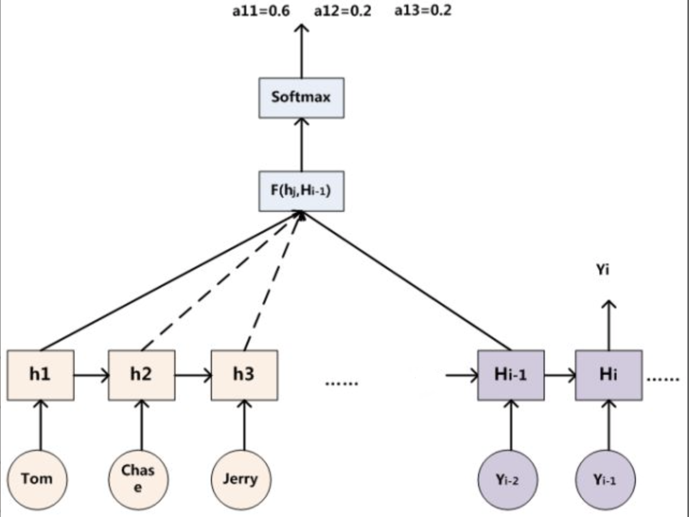

分别用编码器的隐层单元 `ℎ1`,`ℎ2`,`ℎ3` ，与解码器的上一个隐层 `H_i−1` ，进行相似度函数F运算，然后将输出使用Softmax函数得到归一化的概率`𝛼1,𝛼2,𝛼3`，即：

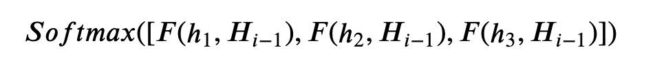

我们比较 `H_i−1`（注意这里不是 `𝐻𝑖`，因为 `𝐻𝑖` 我们暂时还不知道）和 `ℎ𝑗` ，用其相似度作为对应 `𝑥𝑗` 的权重；

### 1.2 Attention
普遍形式的Attention：

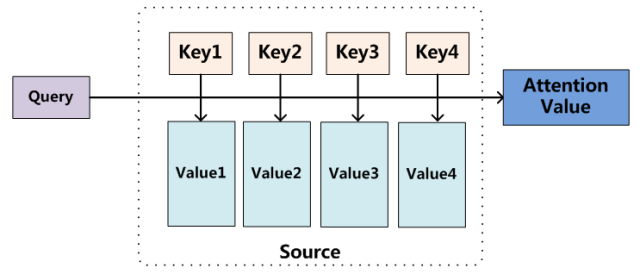

- Source是输入序列，可以**将输入序列看成一系列的`<Key,Value>`对**；
- 给定输出序列Target中的某个元素Query，计算Query和各个Key的相似度，得到每个Key对应Value的权重系数，然后对Value进行加权求和，最终得到Attention输出；

公式为：

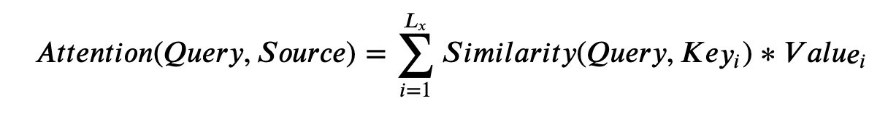

- 其中，𝐿𝑥 为输入序列Source的长度
- NLP中，计算Attention时，一般`Key`和`Value`合二为一，都是输入序列的编码，即 (`ℎ1,ℎ2,ℎ3,...`) 

根据公式：
- 直观上理解，**Attention从大量信息中有选择地筛选出少量重要信息**，并聚焦到这些重要信息上，忽略大多不重要的信息；
- **聚焦的过程体现在权重计算上**，权重越大越聚焦于其对应的Value值上，即权重代表了信息的重要性，而Value是其对应的信息；

### 1.3 三阶段Attention
再抽象一下，可以得到三阶段Attention：


- **阶段1** 根据Query和Key，计算相似度，得到权重系数；相似度的计算，可以是点积、Cosine相似性等；
- **阶段2** 对权重系数使用Softmax函数归一化成概率；
- **阶段3** 根据权重系数对Value进行加权求和；

## 2. Transformer
### 2.1 Transformer整体架构
Transformer也遵循了编码器-解码器的架构，如下图：

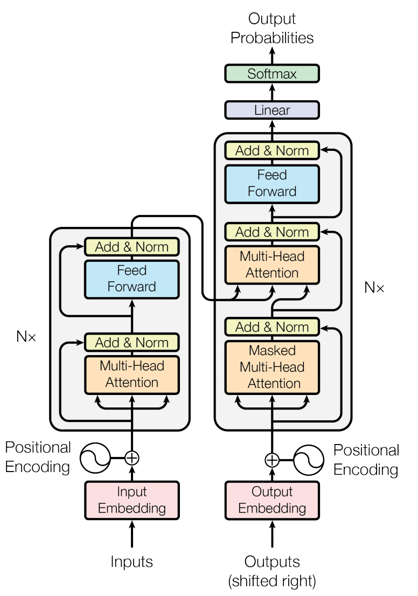

- 上图**以机器翻译任务**为例（根据输入句子、已经预测得到的部分输出，预测下一个输出）
- 左边是编码器部分，右边是解码器部分，它们都是由6（N=6）个大层堆积而成，即：
- 
  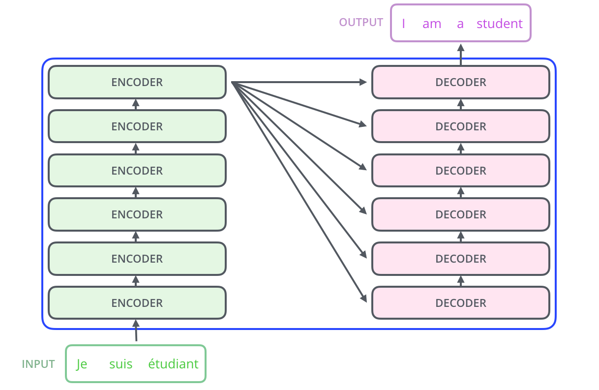

对于**编码器**：
- 每个大层包含两个子层；
- 第一个子层是一个Multi-Head self-Attention，第二个子层是一个全连接的前馈网络；
- 每个子层使用经过layer norm的残差连接；
- 编码器对输入的Embedding进行编码，产生输出，被送入解码器；

对于**解码器**：
- 每个大层包含三个子层；
- 其中上面两个子层的结构与encoder的子层相同，它们在encoder的输出上做Multi-Head Attention；
- 第三个子层在输出上做Masked Multi-Head self-Attention，mask和经过右移1位的输出确保位置 𝑖 的预测仅依赖于小于 𝑖 的已知输出（确保使用过去的输出序列）；
- 每个子层之间也都使用经过layer norm的残差连接；
- 解码器利用编码器的输出张量，以及过去输出序列，进行解码，最终经过全连接层以及softmax函数，产生时刻 𝑖 的输出概率分布；

不管编码器还是解码器，都**使用多头注意力机制提取特征**、都**使用Positional Embedding来表示时序**；

### 2.2 自注意力（Self-Attention）
**Transformer的核心组件是自注意力层**。前面说过，Attention本质是一个针对输出的、在输入序列上的概率分布，那么**如果这里的输出还是输入呢**？

这就是**自注意力机制**，思考下面例子：

`The animal didn't cross the street because it was too tired`

这里的`it`到底指的是什么？是`the animal`、还是`the street`、还是什么？

如下图，自注意力机制可以学到`it`和`the animal`的关联度最强：

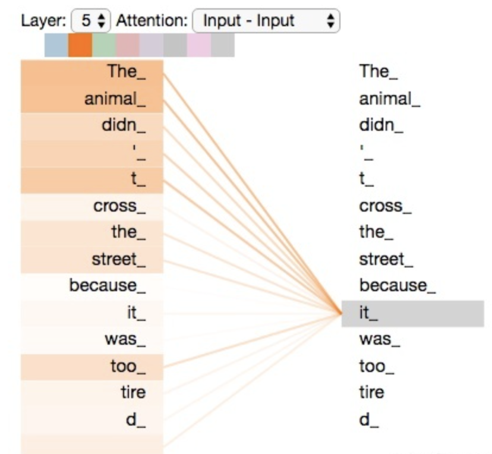

### 2.3 自注意力的计算
在自注意力中，**Query、Key、Value三者一体**，都是输入的编码

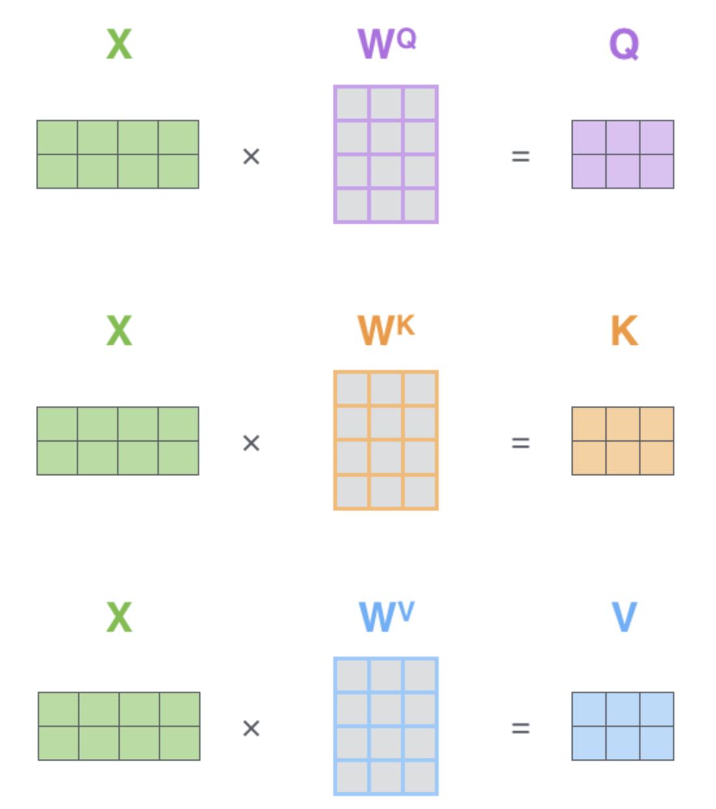

- 这里的 **𝑋 是输入序列**，这里shape为  `𝑠𝑒𝑞_𝑙𝑒𝑛 ∗ 𝑒𝑚𝑏𝑒𝑑𝑑𝑖𝑛𝑔_𝑠𝑖𝑧𝑒` ，原始论文中`embedding_size`为512，这里为4；
- **`W^Q`、`W^K`、`W^V`分别是`Query`、`Key`、`Value`对应的权重矩阵**，shape为 `𝑒𝑚𝑏𝑒𝑑𝑑𝑖𝑛𝑔_𝑠𝑖𝑧𝑒 ∗ d_k` ； `d_k` 即为K的宽度，原始论文中为64，这里是3；
- **输入矩阵 `𝑋` 与权重矩阵 `𝑊` 相乘，分别得到 `𝑄`、`𝐾`、`𝑉`** ，shape均为 `𝑠𝑒𝑞_𝑙𝑒𝑛 ∗ d_k` ；
- 我们看到，这里 **`𝑄`、`𝐾`、`𝑉` 都是输入 `𝑋` 的编码**；

这里使用**缩放点积注意力**（scaled dot-product attention），如下：

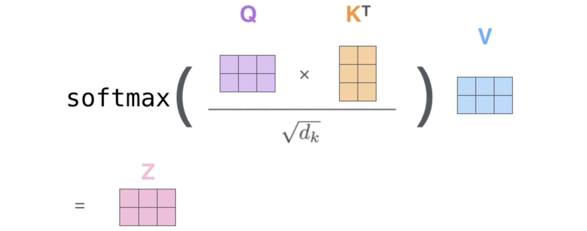

这里**使用 𝑄 和 𝐾 的点积来计算相似度**，并**使用  缩放**，并**使用softmax函数归一为概率**；

### 2.4 多头自注意力
transformer里使用的都是**多头自注意力**。这里的多头，即多个自注意力结合起来的意思

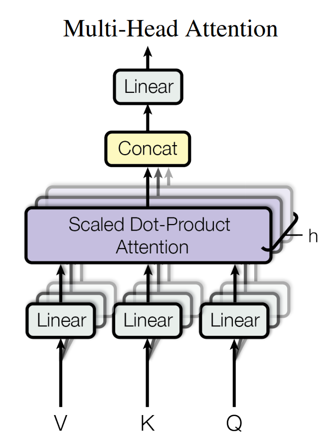

- 将 `𝑄` `𝐾` `𝑉` 分别进行**线性投影后，划分为 ℎ 个头**; （论文里 ℎ=8 ，即8头）
- 对每一个头，将划分后的 **`𝑄` `𝐾` `𝑉` 输入缩放点积Attention结构**；
- 如此**并行计算 ℎ 个，然后将 ℎ 个输出拼接（Concat）起来**，产生最终输出；
- **多头注意力机制使得模型具有了多个焦点的Attention的能力**，表达能力更强；

**具体过程**：

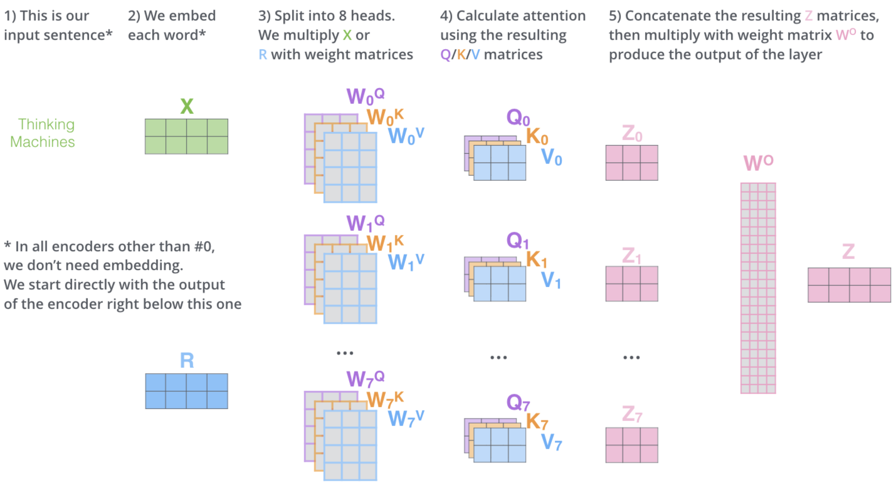

可参考如下代码：
```python
"""
tf版的多头注意力实现

仅用来理解下Transformer的实现，不实际生产使用下面代码
"""
import tensorflow as tf


def scaled_dot_product_attention(q, k, v):
    """
    缩放点积注意力
    """
    # Q K点积
    matmul_qk = tf.matmul(q, k, transpose_b=True)

    # 缩放
    dk = tf.cast(tf.shape(k)[-1], tf.float32)  # dk即为K的最后一个维度
    scaled_attention_logits = matmul_qk / tf.math.sqrt(dk)

    # softmax
    attention_weights = tf.nn.softmax(scaled_attention_logits, axis=-1)

    # attention_weights和V相乘，产生输出
    output = tf.matmul(attention_weights, v)

    return output, attention_weights


# 我们定义一个MultiHeadAttention层
class MultiHeadAttention(tf.keras.layers.Layer):
    """
    多头注意力
    """
    def __init__(self, d_model, num_heads):
        """
        d_model: embedding维度，论文为512
        num_heads: 头的个数，论文为8
        """
        super(MultiHeadAttention, self).__init__()
        self.num_heads = num_heads
        self.d_model = d_model

        assert d_model % self.num_heads == 0  # 确保能整除

        self.depth = d_model // self.num_heads  # depth即为dk，由d_model整除num_heads得到

        # 分别定义Q K V的投影层
        self.wq = tf.keras.layers.Dense(d_model)
        self.wk = tf.keras.layers.Dense(d_model)
        self.wv = tf.keras.layers.Dense(d_model)

        # 定义最后的dense层
        self.dense = tf.keras.layers.Dense(d_model)

    def split_heads(self, x, batch_size):
        """
        划分多头

        分拆最后一个维度d_model到 (num_heads, depth).
        转置结果使得形状为 (batch_size, num_heads, seq_len, depth)
        """
        x = tf.reshape(x, (batch_size, -1, self.num_heads, self.depth))
        return tf.transpose(x, perm=[0, 2, 1, 3])

    def call(self, v, k, q, mask):
        batch_size = tf.shape(q)[0]

        # 对Q K V进行投影
        q = self.wq(q)  # (batch_size, seq_len, d_model)
        k = self.wk(k)  # (batch_size, seq_len, d_model)
        v = self.wv(v)  # (batch_size, seq_len, d_model)

        # 对Q K V划分多头
        q = self.split_heads(q, batch_size)  # (batch_size, num_heads, seq_len_q, depth)
        k = self.split_heads(k, batch_size)  # (batch_size, num_heads, seq_len_k, depth)
        v = self.split_heads(v, batch_size)  # (batch_size, num_heads, seq_len_v, depth)

        # 并行计算多个Q K V的缩放点积注意力
        # scaled_attention.shape == (batch_size, num_heads, seq_len_q, depth)
        # attention_weights.shape == (batch_size, num_heads, seq_len_q, seq_len_k)
        scaled_attention, attention_weights = scaled_dot_product_attention(q, k, v)
        scaled_attention = tf.transpose(scaled_attention,
                                        perm=[0, 2, 1, 3])  # (batch_size, seq_len_q, num_heads, depth)

        # 通过reshape，将attention的结果拼接起来
        concat_attention = tf.reshape(scaled_attention,
                                      (batch_size, -1, self.d_model))  # (batch_size, seq_len_q, d_model)

        # 将拼接后的结果输入全连接层，产生输出
        output = self.dense(concat_attention)  # (batch_size, seq_len_q, d_model)

        return output, attention_weights
```

### 2.5 位置编码
观察到，Transformer没有任何RNN或CNN的结构，没有天然处理序列数据的能力，至此，还不能捕获语序的特征。 也就是说，暂时，**Transformer只是一个强大的词袋模型**。

为了能够处理语序，Transformer使用了**位置编码**，来表示词在序列中的相对位置。

**位置编码是一个向量，和词向量类似，词之间位置的远近，可以用位置向量之间的距离来衡量**；
- 比如位置1的编码向量，与位置2的编码向量距离很近，与位置10的编码向量距离就比较远。

论文中给出的一种**位置编码的计算方式**：


- 其中`pos`是指当前词在句子中的位置，`i`是指向量中每个值的index；
    即**在偶数位置，使用正弦编码，在奇数位置，使用余弦编码**；
- `d_model`为词向量的维度，论文中为512；

**注意**：
- 位置编码最终会和word embedding**相加**，然后输入多头注意力层；
- 位置编码的向量和word embedding的**维度一致**，这便于我们进行元素级别的相加；

### 2.6 前馈网络部分（Feed Forward）
前馈网络部分非常简单，就是**两层的全连接网络**，中间**使用ReLU激活函数**，
公式如下：

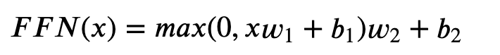

### 2.7 Add & Norm部分
每个子层之间都使用**经过layer norm的残差连接**，

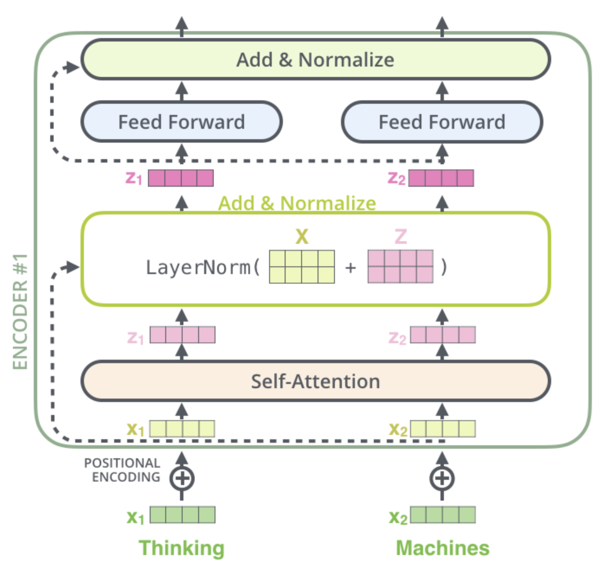

**残差连接即跳跃连接**，输入 𝑋 不仅正常连接到self-attention层，也跳跃连接到了前馈网络层。
**残差连接便于网络的学习、增强了网络的泛化性**。

当前组件实现了 𝐿𝑎𝑦𝑒𝑟𝑁𝑜𝑟𝑚(𝑋+𝑍)  的计算。那么什么是Layer Norm呢？
- **Layer Norm对单条样本的不同特征进行归一化，使模型更稳定、减小过拟合风险**。这里不展开了。

### 2.8 Transformer的优点
总结一下**Transformer的优点**：

- 算法设计比较精彩，它**抛弃了先前NLP中大行其道的RNN和CNN**，并且取得了很好的效果；
- Transformer**使用self-attention**，将输入序列中任意两个单词的距离降为1，这**可以处理更复杂的长程依赖问题**；
- Transformer不仅仅可以应用在机器翻译领域，**在很多常见的NLP领域都可以使用**。接下来将要介绍的基于Transformer的Bert模型，就可以处理很多NLP任务；
- 相比于RNN，它的**并行能力很好**，这都会加快模型训练和预测速度；

## 3. Bert预训练和微调
### 3.1 Bert简介

BERT全称（Bidirectional Encoder Representations from Transformers）。基于transformer的Bert，2018年横空出世，横扫各大NLP评测任务，取得了当时前沿的效果。

Bert**通过预训练，从大量无监督的语料中学习语义信息，预训练结束后通过添加一个额外的输出层进行微调**。

### 3.2 Bert结构
网络结构非常简单，**多层Transformer的Encoder堆叠起来**

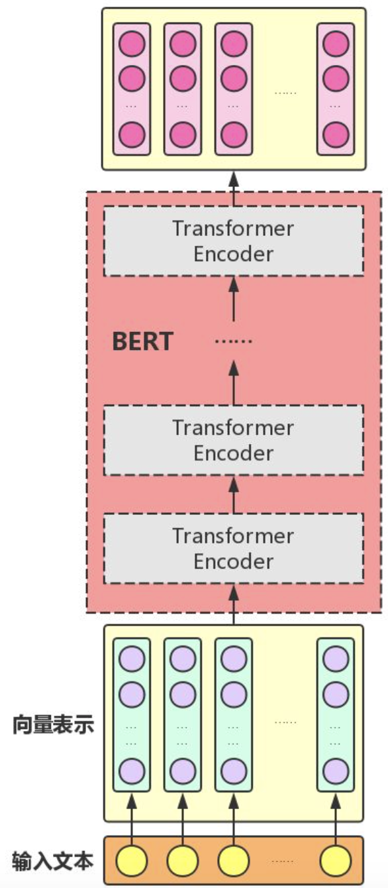

- **输入层**将输入的文本序列表示为向量的形式，然后送入中间层；
- **中间层**由多个Transformer的Encoder部分（不包含Decoder部分）堆积而成； 
  - 𝐵𝐴𝑆𝐸 模型使用了12个Transformer
  - 𝐿𝐴𝑅𝐺𝐸 模型使用了24个Transformer
- **输出层**就是一个普通的全连接层；

### 3.3 输入表示
实际上输入由3部分组成：

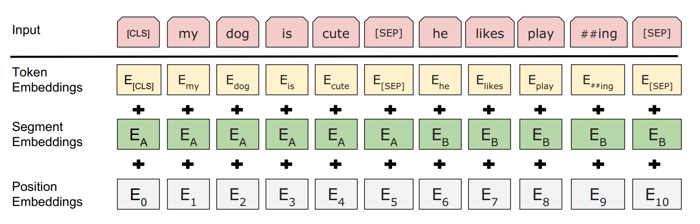

注意：Bert**允许同时输入两个句子**（比如问答），图上就同时输入了`my dog is cute`和`he likes playing`两个句子，用`[SEP]`分隔开；

- **输入embedding由3种embedding相加**得到：Token Embedding, Segment Embedding, Position Embedding；
- **Token Embedding即我们的词向量**，很好理解。
  - 注意，这里的英文单词使用了WordPiece，比如将`playing`拆分为`play`和`ing`两个子词，
  - 这样一方面归一了不同时态下的单词，另一方面减小了词库的大小；
- **Segment Embedding用于区分两种句子**，前一种句子向量全0，后一种句子向量全1。即 𝐸𝐴=0 ， 𝐸𝐵=1 ；
- **Position Embedding将位置信息编码为向量**；
- **输入的开头是一个特殊的Token**——`[CLS]`，最终输出的`[CLS]`的embedding可以看做句子的embedding，可以使用其来做分类任务；

### 3.4 预训练
Bert是一个**预训练模型**；

预训练模型是**在大量无监督语料中训练一个模型，然后在做下游任务时，只需要简单的修改一些输出层，再用少量数据进行一个增量训练**，对权重进行一个轻微的调整；

Bert使用**两种无监督的任务进行预训练**，分别是**Masked LM**和**Next Sentence Prediction**(NSP)；

#### Masked语言模型（Masked LM）
**MLM的任务描述**为：
给定一句话，随机抹去这句话中的一个或几个词，要求根据剩余词汇预测被抹去的几个词分别是什么，**类似于完形填空**；

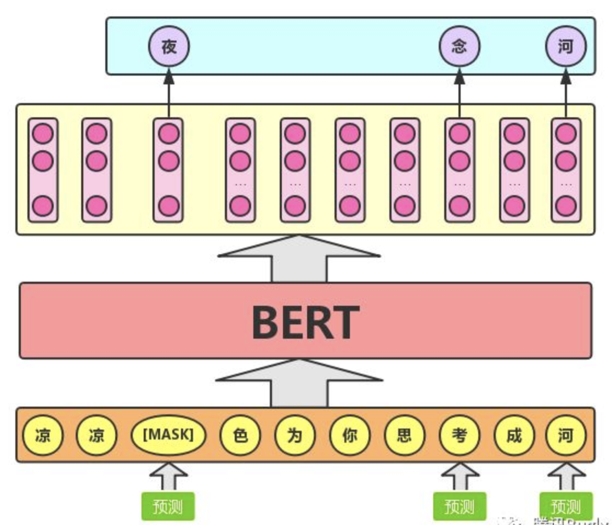

- **传统语言模型**基于马尔科夫假设，只能从左向右、或者从右向左单向编码；**基于深度Transformer的Masked LM**能够同时学到前文、后文的双向特征，更为强大；
- Bert会**对输入序列中的15%词汇进行随机Mask**，然后**在输出层去预测它们**；
  - 比如，我们对输入中的 `夜` 进行 `[MASK]` ，然后在输出层预测 `夜`；
- 直接Mask会带来一个问题，预训练完之后，我们要进行下游的比如分类任务时（也被称为fine-tuning微调），我们不会传入任何Mask的输入，这会带来**预训练和微调的输入不一致**。
  - 为了缓解此类问题，Bert在决定Mask时，会**以80%的概率Mask，10%的概率随机替换一个词，10%的概率保持不变**；
  - 如前图，将 `念` 随机替换为 `考` ，将 `河` 保持不变，同样，在输出层分别预测 `念` 和 `河`；
  - 以10%的概率随机替换，也会为我们的语言模型带来一定的容错能力；

#### 下一个句子预测（NSP, Next Sentence Prediction）
Bert还使用**NSP任务**来预训练，其被描述为：
给定一篇文章中的两句话，判断第二句话在文本中是否紧跟在第一句话之后，是个分类任务；

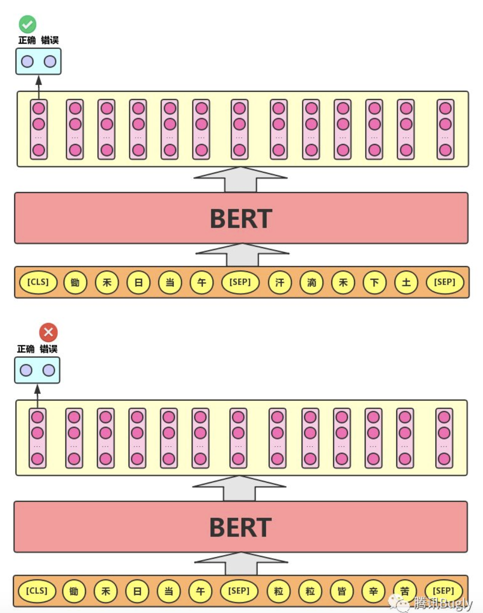

- 如上图，我们同时输入两个句子`锄禾日当午`、`汗滴禾下土`，我们的标签应该是`正确`，表示句子2是句子1的下一句；

- 我们同时输入两个句子`锄禾日当午`、`粒粒皆辛苦`，我们的标签应该是`错误`，表示句子2不是句子1的下一句；

**NSP是分类问题**，使用第0个输出作分类，这里是2分类，`正确` 或 `错误`；

**NSP能让模型学到句子之间的一些顺序信息**，而上面的MLM，学到的更多的是词之间的信息；

BERT模型通过对**Masked LM任务**和**Next Sentence Prediction任务**进行联合训练，使模型输出的每个字/词的向量表示都能尽可能全面、准确地刻画输入文本（单句或语句对）的整体信息，为后续的微调任务提供更好的模型参数初始值。

### 3.5 微调
Bert的预训练需要在大量的无监督语料上，消耗巨大的计算资源，一般较难实现。**一般的实践中**，我们也不会自己预训练Bert，而是**直接使用谷歌或者其他第三方已经训练好的Bert模型**。

我们较常用的Bert场景，就是**微调Bert**，即：
- 使用别人预训练好的bert模型，初始化网络参数；
- 根据下游不同的nlp场景，在后面添加一些自定义的层，微调下网络，得到模型；

下图展示了**BERT在11个不同任务中的模型**，它们只需要在BERT的基础上再添加一个输出层便可以完成对特定任务的微调。**Bert还是很强大的，能做的NLP任务很多**；

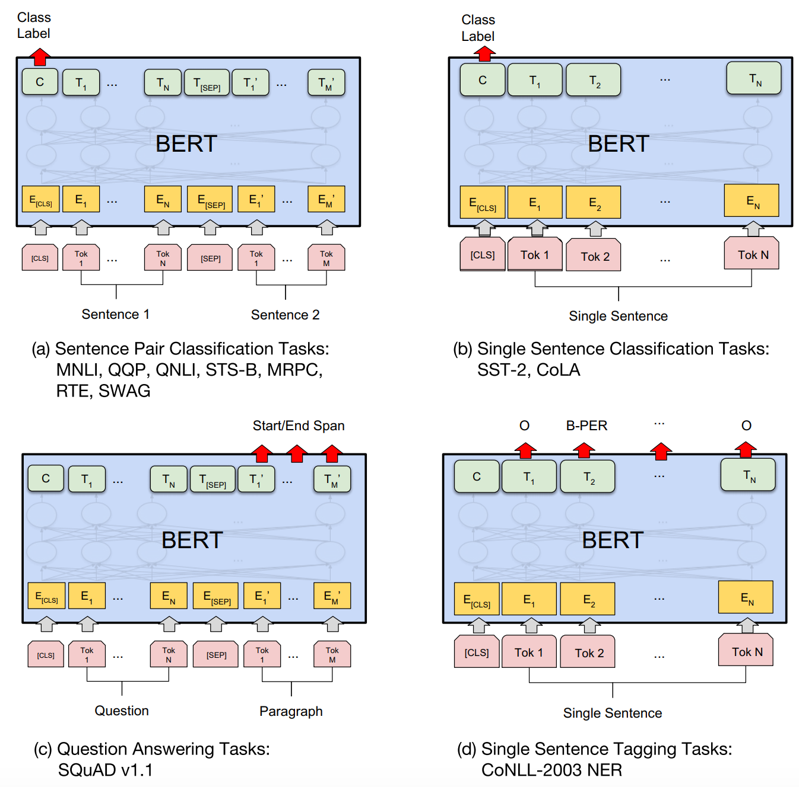

- **输入可以是1个句子，也可以是2个句子**，每个句子用多个Token来表示，两个句子用`[SEP]`隔开；第一个输入为`[CLS]`；
- **每个输入会有其对应的E**，即Embedding；
- **输入会经过多层Transformer编码，产生输出**， 𝐶 是第0个输出，可以认为是句子Embedding， 𝑇𝑖 对应第 𝑖 个输入的抽象表示；

典型的任务：
- **分类任务**，输入单个句子，然后将输出的 𝐶 接入全连接层，做多分类；
- **查重任务**，同时输入两个句子，然后将输出的 𝐶 接入全连接层，做2分类，判断两个句子是否重复；
- **序列标注任务**，输入单个句子，然后用输出的 𝑇1 ~ 𝑇𝑁 做序列标注（还可以再接入CRF层，学习标签之间的转移）；
