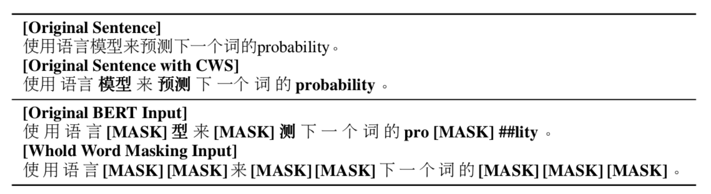
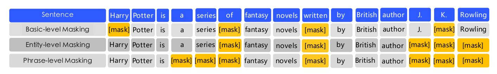
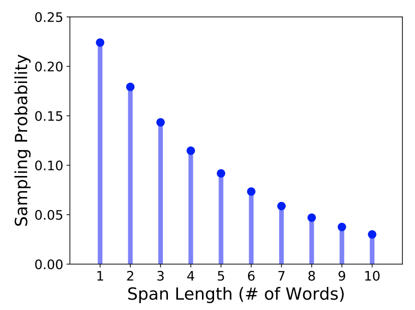
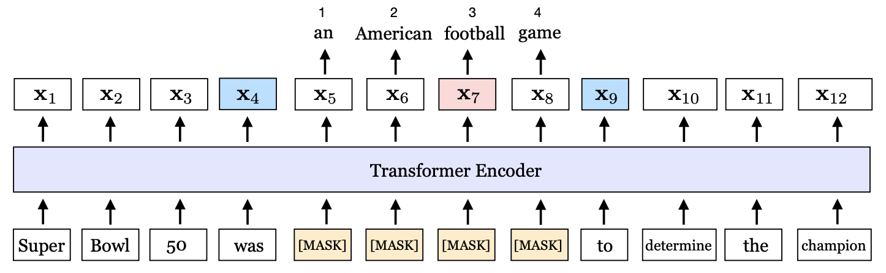
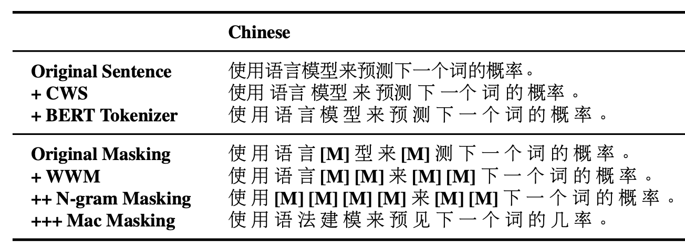
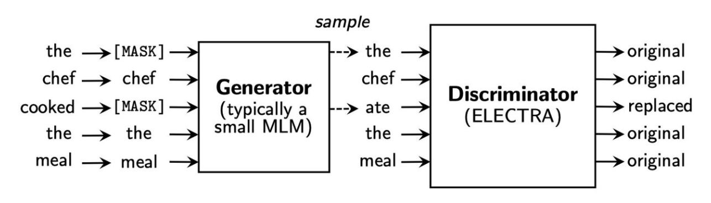

目录
1. [RoBERTa](#1-roberta)
2. [ALBERT](#2-albert)
3. [Bert-wwm](#3-bert-wwm)
4. [ERNIE](#4-ernie)
5. [SpanBert](#5-spanbert)
6. [MacBert](#6-macbert)
7. [ELECTRA](#7-electra)

## 1. RoBERTa
RoBERTa，即**Bert预训练方法的鲁棒优化**：
- 模型**训练时间更长，Batch Size更大，训练数据更多**；
- **删除了NSP任务**。作者经过实验，发现NSP任务没啥卵用，删除了之后效果反而提升了一些；
- 使用**动态MASK**：
  - BERT预训练时，是静态MASK，即在预训练前统一进行随机MASK，这导致多个epoch使用的都是一样的MASK；
  - RoBERTa在**每次输入时进行MASK，确保每个epoch下的训练数据，使用不同MASK方式**；

## 2. ALBERT
ALBERT，即**轻量级bert**，主要解决Bert预训练太耗资源：

- **对Embedding层的参数矩阵**（ `|𝑉|∗|𝐻|` ， `|𝑉|` 为词库大小,  `|𝐻|` 为隐层大小）**进行分解**，减少了一小部分的参数（`V*H` -> `V*E + E*H`），并带来效果的一些下降；
- **共享所有Transformer的参数**，即12个Transformer都使用相同的Attention参数、或相同的FFN参数、或相同的所有参数。主要的参数减少是靠这个操作，可以减少十几倍的参数（可减少到12M）；
- 为了缓解参数降低带来的效果的下降，**ALBERT使用SOP**（Sentence Order Prediction）**替代了NSP任务**；

**NSP任务**（二分类）样本的构造：
- **正样本**：同文章，相邻的两句话；	
- **负样本**：不同文章的两句话；

NSP任务效果不好，作者认为是**负样本的构造跨了文章**， 因为NSP既包含了主题预测，又包含了连续性预测；

而**SOP任务**样本的构造：
- **正样本**：同文章，相邻的两句话；
- **负样本**：正样本顺序对掉；

<br>

比如下面这个**例子**：
```
文档1：锄禾日当午，汗滴禾下土
文档2：鹅鹅鹅，曲项向天歌
```
**NSP任务**构造：
- 正样本：`锄禾日当午[SEP]汗滴禾下土`
- 负样本：`锄禾日当午[SEP]曲项向天歌`

**SOP任务**构造：
- 正样本：`锄禾日当午[SEP]汗滴禾下土`
- 负样本：`汗滴禾下土[SEP]锄禾日当午`

<br>

尽管参数减少可以训练更快，但在**推理阶段，ALBERT并没有提升多少速度**；
- 因为12个Transformer还是要逐层计算的；

## 3. Bert-wwm
Bert-wwm，即**基于全词mask的bert预训练**，**减少了词汇信息对学习语言模型干扰**，增强了MLM的上下文预测能力。原理如下图：



在决定要MASK`模`这个字时，最终MASK的是`模型`这个词。

Bert-wwm-ext，在wwm基础上，使用了更多的数据；

## 4. ERNIE
ERNIE**将Mask的方式扩展到短语和实体级别**：



## 5. SpanBert
SpanBert进行MLM时，**随机mask一小段文本**。

以**一定的概率，采样一个span长度**，然后**随机采样起始位置，进行mask**，然后输出去预测它：
1. **Span长度的概率分布**如下：



2. span长度和span起始位置随机确定后，进行**MASK，示例如下**：

  - 

  - 以`x5`位置起始，MASK的span长度为`4`，MASK后，在输出层预测当前span，即：`an American football game`

## 6. MacBert
MacBert依然是**改进MLM的Mask方式**，

1. 首先分词，**基于词粒度的n-gram进行Mask**，1gram~4gram的概率分别是40%、30%、20%、10%；

2. **不使用`[MASK]`token进行mask**，对15％的输入单词进行masking时：
   - **80％替换为同义词**，区别于原始bert的直接打`[MASK]`；
   - 10％将替换为随机词；
   - 10％则保留原始词；

如下图，



决定要MASK`模`时，使用了4-gram的MASK，并不是使用`[MASK]`token，而是用同义词`语法建模`来替换`语言模型`。

另外，和ALBERT一样，MacBert也使用SOP任务替代NSP任务。

## 7. ELECTRA
electra借鉴了对抗网络（GAN）的部分思想，**不使用MLM，而是RTD任务**（Replaced Token Detection）；

模型由两部分组成，分别是**Generator**以及**Discriminator**，两个都是transformer的encoder结构，只是size不同。如下图：



**生成器**：
- 即一个**小的MLM**，size为判别器的1/4；
- 随机选取**15%的token，替代为`[MASK]`**token；
- 使用Generator去训练模型，使得**模型预测被Mask的部分**；（可能预测错）
- 如图，`the` 和 `cooked` 被随机选为被`[MASK]`，经过Generator，变成了`the`和`ate`；

**判别器**：
- 对Generator预测的结果，分辨其是`original`的还是`replaced`；
- 对于**每个token**，Discriminator都会进行这样一个**二分类**；
- 如图，`ate`被Discriminator认为是`replaced`，其余为`original`；

主要解决了bert的**两个较大的“问题”**：
- **BERT的MLM并不高效，只有15%的token对参数更新有用**，其余并不参与梯度更新；
- **预训练和fine-tuning的不匹配**，因为fine-tuning并不会有`[MASK]`的token；

另外**注意两点**：
1. electra的**微调只需要使用判别器**；
2. 实践中，electra的效果可能不如Roberta等，但是**其小模型（tiny）效果比较好**，在高性能、资源有限场景下可以尝试；
