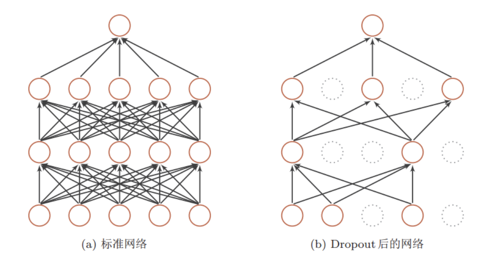
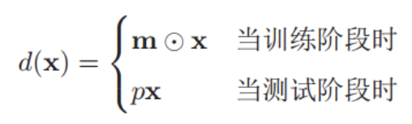

目录
1. [Dropout](#1-dropout)
2. [Dropout有效性](#2-dropout)

## 1. Dropout
Dropout通过**随机丢弃一部分神经元来避免过拟合**，如下图：

Dropout被**定义**为，对于一个线性层`y=f(Wx+b)`，引入一个**丢弃函数**`d(•)`，使得`y=f(Wd(x)+b)`。

其中，**丢弃函数**被定义为：

- `m∈{0,1}`是丢弃掩码，**训练时**以概率为p的*0-1分布*随机生成
- **预测时**为了结果稳定，不丢弃神经元，但会乘上p (dropout rate)，相当于平均一下结果

## 2. Dropout有效性
**为什么dropout会有效**？

从**集成学习的角度**：
- 训练时，每次**随机采样一个完整网络的子网络**；
- 预测时，相当于**集成了这些不同结构的子网络**；
