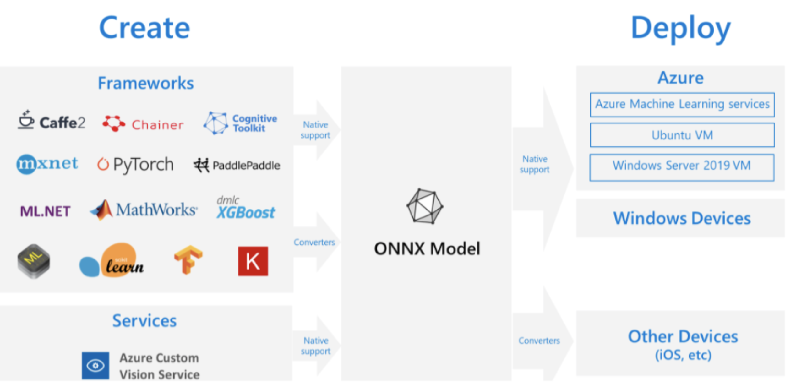
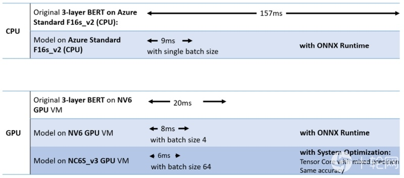

目录
1. [ONNX简介](#1-ONNX简介)
2. [实践](#2-实践)

## 1. ONNX简介
工业里，线上部署尤为重要。 如果**深度学习模型推理（预测）可以节省一些GPU资源**、**甚至是仅使用CPU完成**，岂不美哉？

一个**比较成熟的加速推理方案**：ONNX模型格式 + ONNX Runtime

<br>

下面是**onnx模型标准**：



ONNX提供了**一套标准的AI模型格式**，可以统一传统的机器学习、前沿的深度学习模型。

模型定义使用了protocal buffer。

<br>

**ONNX Runtime**是微软开源的一套**针对ONNX模型标准的推理加速引擎**， 通过**内置的图优化**（Graph  Optimization）和各种**硬件加速**来实现。

下面是**加速效果对比**：



## 2. 实践
ONNX实现包括**三步**：
1. 定义伪输入，将torch模型**导出为onnx模型**；
2. 使用`onnxruntime.InferenceSession`，**加载onnx模型**；
3. 将输入转为numpy，**进行推理**；

**部分代码示例**：
```python
# 定义伪输入，让onnx做一遍推理，构建静态计算图
dummy_inputs = torch.LongTensor([[i for i in range(200)]])
dummy_att_masks = torch.LongTensor([[1 for _ in range(200)]])
dummy_inputs, dummy_att_masks = dummy_inputs.to(self.device), dummy_att_masks.to(self.device)

# 将模型导出为onnx标准
torch.onnx.export(
    self.model, (dummy_inputs, dummy_att_masks),
    '{}/model.onnx'.format(self.model_dir),
    # 设置model的输入输出，参考ClassificationModel.forward函数签名
    input_names=['input1', 'input2'], output_names=['output'],  # 两个输入，一个输出
    # 设置batch、seq_len维度可变
    dynamic_axes={'input1': {0: 'batch', 1: 'seq'}, 'input2': {0: 'batch', 1: 'seq'}, 'output': {0: 'batch'}},
    opset_version=10,
)


# 加载onnx model
self.onnx_model = InferenceSession('{}/model.onnx'.format(self.model_dir))
self.onnx_model.get_modelmeta()


# onnx model推理
best_labels = self.onnx_model.run(
    ['output'],  # 设置输出names
    # feed输入，并转化为numpy数组
    {'input1': batch_input_ids.cpu().numpy(), 'input2': batch_att_mask.cpu().numpy()}
)[0]
```

**完整代码**请参考以下源代码：
- [easy_bert/bert4classification/classification_predictor.py](https://github.com/waking95/easy-bert/blob/main/easy_bert/bert4classification/classification_predictor.py)
- [easy_bert/bert4sequence_labeling/sequence_labeling_predictor.py](https://github.com/waking95/easy-bert/blob/main/easy_bert/bert4sequence_labeling/sequence_labeling_predictor.py)