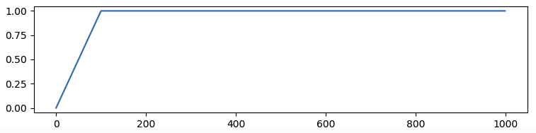
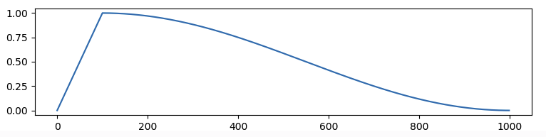
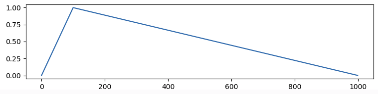

目录
1. [Warmup原理](1-warmup原理)

## 1. Warmup原理
warmup使用**动态的学习率**（一般lr先增大 后减小），
- lr一开始别太大，有助于缓解模型在初始阶段，对前几个batch数据过拟合；
- lr后面小一点，有助于模型后期的稳定；

常见的**warmup种类**：
  - **constant**，表示使用恒定学习率，lr曲线为 
  - **cosine**，表示余弦曲线学习率，lr曲线为 
  - **linear**，表示线性学习率，lr曲线为 
