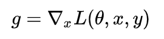
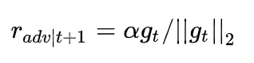
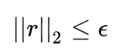

## 1. 对抗简介
对抗训练主要通过**对embedding加噪**，来**实现正则化**。这里注意：
- **噪声（扰动）应该沿着梯度的方向**，目的是使loss变大；
- 加噪后的embedding输入变为：`x+r`；

下面主要介绍**两种对抗训练方法**：
1. **FGM** (Fast Gradient Method)
2. **PGD** (Projected Gradient Descent)

## 2. FGM
FGM (Fast Gradient Method)，扰动定义为：

其中：
- `g`为embedding向量x的梯度：
- `ϵ`为超参数

**注意**：
1. **扰动的方向为梯度的方向**；
2. **对梯度进行了二范数的归一**；

## 3. PGD
FGM直接给出了扰动的定义，但未必是最优的。**PGD(Projected Gradient Descent)允许我们多扰动几次，慢慢找到最优的扰动值**。

PGD的扰动定义为：，且

其中：
- `α`为步长，`g`为梯度
- `ϵ`最大扰动半径，当扰动`r`超过`ϵ`时将会被投影

**注意**：
1. 第t+1次的扰动`r`由第t次的梯度算出
2. 对`x`的T次扰动将会被累加，即最终的扰动为：`r1+r2+……+rT`

