目录
1. [标签平滑loss](#1-标签平滑loss)
2. [Focal loss](#2-focal-loss)
3. [crf loss](#3-crf-loss)

## 1. 标签平滑loss
标签平滑也是**一种正则化方法**，它**在label层面增加噪声**，使用soft label替代hard label。如下图：


**交叉熵loss**定义为：


其中：
- `K`为多分类的**类别数**，`y`为**onehot过后的label**：
- `p`为logits经过**softmax后的概率**：

**标签平滑使用soft label**，即：

- `α`为超参数，一般设置为`0.1`                      

**代码示例**：from [easy_bert/losses/label_smoothing_loss.py](https://github.com/waking95/easy-bert/blob/main/easy_bert/losses/label_smoothing_loss.py)
```python
import torch.nn as nn
import torch.nn.functional as F


class LabelSmoothingCrossEntropy(nn.Module):
    """标签平滑过的交叉熵loss"""

    def __init__(self, alpha=0.1, reduction='mean', ignore_index=-100):
        super(LabelSmoothingCrossEntropy, self).__init__()
        self.alpha = alpha

        assert reduction in ('mean', 'sum')
        self.reduction = reduction  # 对batch维度的loss的处理策略，可以是mean或者sum

        self.ignore_index = ignore_index  # 忽略target中为ignore_index的位置

    def forward(self, logits, target):
        """计算标签平滑过的交叉熵loss，请参照公式"""

        # 获取类别数K
        K = logits.size()[-1]

        # 对logits计算softmax得到概率，并取log
        log_preds = F.log_softmax(logits, dim=-1)
        # 去掉ignore_index位置的结果
        active_log_preds = log_preds[target != self.ignore_index]

        # 计算非target部分的loss
        if self.reduction == 'sum':
            no_target_loss = -active_log_preds.sum()  # 同时沿着batch和label维度求和
        else:
            no_target_loss = -active_log_preds.sum(dim=-1)  # 沿着label维度求和
            if self.reduction == 'mean':
                no_target_loss = no_target_loss.mean()  # 沿着batch维度平均
        no_target_loss = self.alpha / K * no_target_loss  # 乘上非target部分的yi

        # 计算target部分的loss
        # 借助torch自带的计算交叉熵的函数F.nll_loss，并乘上target部分的yi
        target_loss = (1 - self.alpha) * F.nll_loss(log_preds, target,
                                                    reduction=self.reduction, ignore_index=self.ignore_index)

        return no_target_loss + target_loss
```

## 2. Focal loss
在分类或序列标注任务中，可能存在**标签分布不均衡问题**，除了在数据层面做一些增强之外，还**可以换focal loss**。

回顾下**二元交叉熵**（BinaryCrossEntropyLoss）：

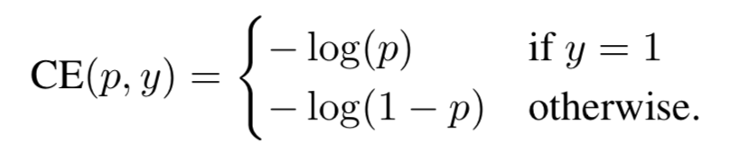

这里，
  - `y∈{±1}` 即**正确label**；
  - `p∈[0,1]` 即**模型预测label=1的概率**；

定义`p_t` 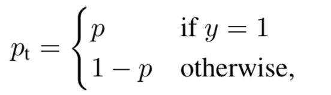 ，于是 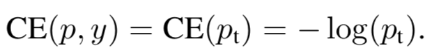

<br>

**交叉熵loss对不同的label是一视同仁的**， 对于NER，我们目标是让loss更多关注非“O”的标签（抓重点）

于是，可以**为每个类别设置一个独立的权重`α`**，即：

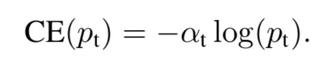

其中：`α∈[0,1]`，通常被**设置为label频率的倒数**，或者被**视为一个超参数**

<br>

尽管实现了重点优化非“O”标签，但可以更进一步，**重点优化那些较难的样本**。
可以为样本设置难度权重 `(1−p_t)^γ`，即

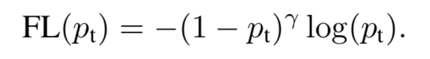

- 越**简单的样本**，模型易将p预测接近`1`，其对loss贡献就少；
- 越**难的样本**，模型易将p预测接近`0`，其对loss贡献不变；

这里，`γ`**是一个超参数，控制降权程度**（对简单样本降权），如下图：

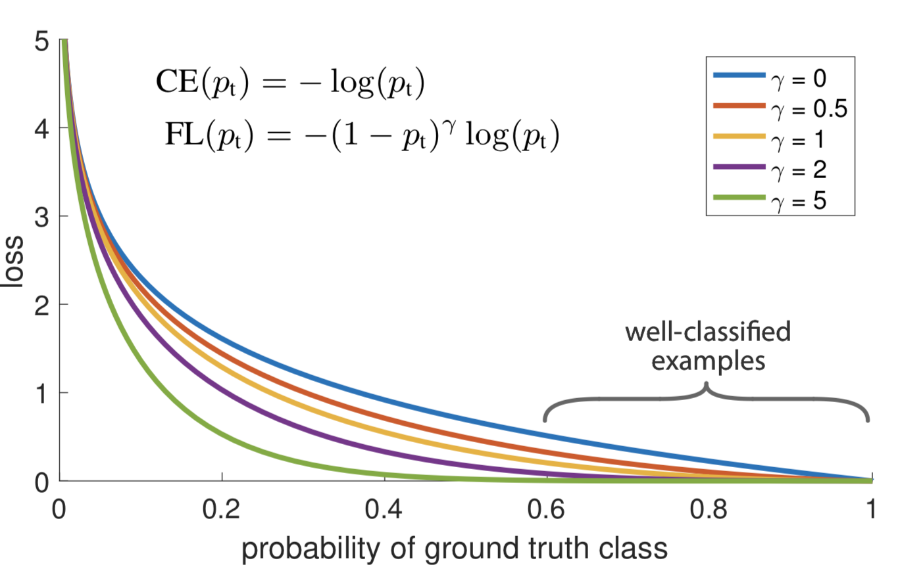

- `γ`**越大，对简单样本打压越厉害**；
- 当`γ`为`0`时，退化为交叉熵损失；

<br>

最终，我们综合得到focal loss：

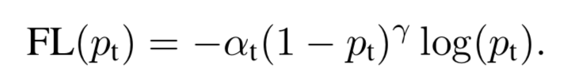

在交叉熵基础上，
- `α` 控制**重点优化那些频率较低的label**；
- `(1−p_t)^γ`控制**重点优化那些难学的样本**；

**代码示例**：from [easy_bert/losses/focal_loss.py](https://github.com/waking95/easy-bert/blob/main/easy_bert/losses/focal_loss.py)
```python
import torch
import torch.nn as nn
import torch.nn.functional as F
from torch.autograd import Variable


class FocalLoss(nn.Module):
    """focal loss"""

    def __init__(self, gamma=0, alpha=None, size_average=True):
        super(FocalLoss, self).__init__()
        self.gamma = gamma
        self.alpha = alpha
        if isinstance(alpha, (float, int, int)):
            self.alpha = torch.Tensor([alpha, 1 - alpha])
        if isinstance(alpha, list):
            self.alpha = torch.Tensor(alpha)
        self.size_average = size_average

    def forward(self, input, target):
        if input.dim() > 2:
            input = input.view(input.size(0), input.size(1), -1)  # N,C,H,W => N,C,H*W
            input = input.transpose(1, 2)  # N,C,H*W => N,H*W,C
            input = input.contiguous().view(-1, input.size(2))  # N,H*W,C => N*H*W,C
        target = target.view(-1, 1)

        # 计算pt
        logpt = F.log_softmax(input)
        logpt = logpt.gather(1, target)
        logpt = logpt.view(-1)
        pt = Variable(logpt.data.exp())

        # 计算log_pt * alpha
        if self.alpha is not None:
            if self.alpha.type() != input.data.type():
                self.alpha = self.alpha.type_as(input.data)
            at = self.alpha.gather(0, target.data.view(-1))  # 根据label，选择对应的label权重
            logpt = logpt * Variable(at)  # log_pt * alpha

        # focal loss 公式
        loss = -1 * (1 - pt) ** self.gamma * logpt

        return loss.mean() if self.size_average else loss.sum()
```

## 3. crf loss
crf层一般**被用在序列标注任务的最后一层**，**学习标签之间的转移**，参数为一个`n*n`的转移矩阵，`n`为label_size。下面是一个转移矩阵的例子：

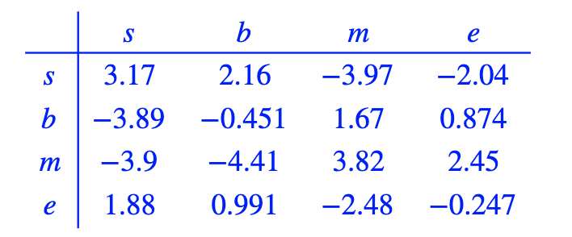

从图中可以看出，`b->s` `m->s`的转移几乎不太可能出现，因为权重很低。

**crf loss的目标**是：*让正确路径的score的比重*在*所有路径score之和*的占比(softmax)中越大越好。如下图：

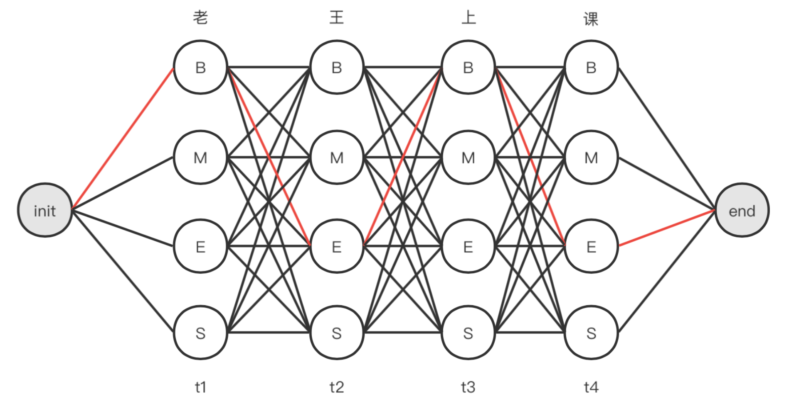

我们目标是让 `B -> E -> B -> E` 这条红色的**正确路径的score**占**所有路径的总score**的比例最大。

写成公式：

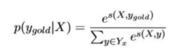

正确路径我们一般称为gold path。使用负log最大似然，即得到**最终crf loss**：

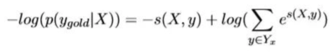

**代码示例**：from [easy_bert/losses/crf_layer.py](https://github.com/waking95/easy-bert/blob/main/easy_bert/losses/crf_layer.py)
```python
import torch
import torch.nn as nn

"""
本代码主要来自fastNLP
https://github.com/fastnlp/fastNLP/blob/master/fastNLP/modules/decoder/crf.py
"""


class CRF(nn.Module):
    r"""
    条件随机场。提供forward()以及viterbi_decode()两个方法，分别用于训练与inference。
    """

    def __init__(self, num_tags, include_start_end_trans=False, allowed_transitions=None):
        r"""
        :param int num_tags: 标签的数量
        :param bool include_start_end_trans: 是否考虑各个tag作为开始以及结尾的分数。
        :param List[Tuple[from_tag_id(int), to_tag_id(int)]] allowed_transitions: 内部的Tuple[from_tag_id(int),
                                   to_tag_id(int)]视为允许发生的跃迁，其他没有包含的跃迁认为是禁止跃迁，可以通过
                                   allowed_transitions()函数得到；如果为None，则所有跃迁均为合法
        """
        super(CRF, self).__init__()

        self.include_start_end_trans = include_start_end_trans
        self.num_tags = num_tags

        # the meaning of entry in this matrix is (from_tag_id, to_tag_id) score
        self.trans_m = nn.Parameter(torch.randn(num_tags, num_tags))
        if self.include_start_end_trans:
            self.start_scores = nn.Parameter(torch.randn(num_tags))
            self.end_scores = nn.Parameter(torch.randn(num_tags))

        if allowed_transitions is None:
            constrain = torch.zeros(num_tags + 2, num_tags + 2)
        else:
            constrain = torch.full((num_tags + 2, num_tags + 2), fill_value=-10000.0, dtype=torch.float)
            has_start = False
            has_end = False
            for from_tag_id, to_tag_id in allowed_transitions:
                constrain[from_tag_id, to_tag_id] = 0
                if from_tag_id == num_tags:
                    has_start = True
                if to_tag_id == num_tags + 1:
                    has_end = True
            if not has_start:
                constrain[num_tags, :].fill_(0)
            if not has_end:
                constrain[:, num_tags + 1].fill_(0)
        self._constrain = nn.Parameter(constrain, requires_grad=False)

        nn.init.xavier_normal_(self.trans_m)

    def _normalizer_likelihood(self, logits, mask):
        r"""Computes the (batch_size,) denominator term for the log-likelihood, which is the
        sum of the likelihoods across all possible state sequences.
        :param logits:FloatTensor, max_len x batch_size x num_tags
        :param mask:ByteTensor, max_len x batch_size
        :return:FloatTensor, batch_size
        """
        seq_len, batch_size, n_tags = logits.size()
        alpha = logits[0]
        if self.include_start_end_trans:
            alpha = alpha + self.start_scores.view(1, -1)

        flip_mask = mask.eq(False)

        for i in range(1, seq_len):
            emit_score = logits[i].view(batch_size, 1, n_tags)
            trans_score = self.trans_m.view(1, n_tags, n_tags)
            tmp = alpha.view(batch_size, n_tags, 1) + emit_score + trans_score
            alpha = torch.logsumexp(tmp, 1).masked_fill(flip_mask[i].view(batch_size, 1), 0) + \
                    alpha.masked_fill(mask[i].eq(True).view(batch_size, 1), 0)

        if self.include_start_end_trans:
            alpha = alpha + self.end_scores.view(1, -1)

        return torch.logsumexp(alpha, 1)

    def _gold_score(self, logits, tags, mask):
        r"""
        Compute the score for the gold path.
        :param logits: FloatTensor, max_len x batch_size x num_tags
        :param tags: LongTensor, max_len x batch_size
        :param mask: ByteTensor, max_len x batch_size
        :return:FloatTensor, batch_size
        """
        seq_len, batch_size, _ = logits.size()
        batch_idx = torch.arange(batch_size, dtype=torch.long, device=logits.device)
        seq_idx = torch.arange(seq_len, dtype=torch.long, device=logits.device)

        # trans_socre [L-1, B]
        mask = mask.eq(True)
        flip_mask = mask.eq(False)
        trans_score = self.trans_m[tags[:seq_len - 1], tags[1:]].masked_fill(flip_mask[1:, :], 0)
        # emit_score [L, B]
        emit_score = logits[seq_idx.view(-1, 1), batch_idx.view(1, -1), tags].masked_fill(flip_mask, 0)
        # score [L-1, B]
        score = trans_score + emit_score[:seq_len - 1, :]
        score = score.sum(0) + emit_score[-1].masked_fill(flip_mask[-1], 0)
        if self.include_start_end_trans:
            st_scores = self.start_scores.view(1, -1).repeat(batch_size, 1)[batch_idx, tags[0]]
            last_idx = mask.long().sum(0) - 1
            ed_scores = self.end_scores.view(1, -1).repeat(batch_size, 1)[batch_idx, tags[last_idx, batch_idx]]
            score = score + st_scores + ed_scores
        # return [B,]
        return score

    def forward(self, feats, tags, mask):
        r"""
        用于计算CRF的前向loss，返回值为一个batch_size的FloatTensor，可能需要mean()求得loss。
        :param torch.FloatTensor feats: batch_size x max_len x num_tags，特征矩阵。
        :param torch.LongTensor tags: batch_size x max_len，标签矩阵。
        :param torch.ByteTensor mask: batch_size x max_len，为0的位置认为是padding。
        :return: torch.FloatTensor, (batch_size,)
        """
        feats = feats.transpose(0, 1)
        tags = tags.transpose(0, 1).long()
        mask = mask.transpose(0, 1).float()
        all_path_score = self._normalizer_likelihood(feats, mask)
        gold_path_score = self._gold_score(feats, tags, mask)

        return all_path_score - gold_path_score

    def viterbi_decode(self, logits, mask, unpad=False):
        r"""给定一个特征矩阵以及转移分数矩阵，计算出最佳的路径以及对应的分数
        :param torch.FloatTensor logits: batch_size x max_len x num_tags，特征矩阵。
        :param torch.ByteTensor mask: batch_size x max_len, 为0的位置认为是pad；如果为None，则认为没有padding。
        :param bool unpad: 是否将结果删去padding。False, 返回的是batch_size x max_len的tensor; True，返回的是
            List[List[int]], 内部的List[int]为每个sequence的label，已经除去pad部分，即每个List[int]的长度是这
            个sample的有效长度。
        :return: 返回 (paths, scores)。
                    paths: 是解码后的路径, 其值参照unpad参数.
                    scores: torch.FloatTensor, size为(batch_size,), 对应每个最优路径的分数。
        """
        batch_size, max_len, n_tags = logits.size()
        seq_len = mask.long().sum(1)
        logits = logits.transpose(0, 1).data  # L, B, H
        mask = mask.transpose(0, 1).data.eq(True)  # L, B
        flip_mask = mask.eq(False)

        # dp
        vpath = logits.new_zeros((max_len, batch_size, n_tags), dtype=torch.long)
        vscore = logits[0]  # bsz x n_tags
        transitions = self._constrain.data.clone()
        transitions[:n_tags, :n_tags] += self.trans_m.data
        if self.include_start_end_trans:
            transitions[n_tags, :n_tags] += self.start_scores.data
            transitions[:n_tags, n_tags + 1] += self.end_scores.data

        vscore += transitions[n_tags, :n_tags]

        trans_score = transitions[:n_tags, :n_tags].view(1, n_tags, n_tags).data
        end_trans_score = transitions[:n_tags, n_tags + 1].view(1, 1, n_tags).repeat(batch_size, 1, 1)  # bsz, 1, n_tags

        # 针对长度为1的句子
        vscore += transitions[:n_tags, n_tags + 1].view(1, n_tags).repeat(batch_size, 1) \
            .masked_fill(seq_len.ne(1).view(-1, 1), 0)
        for i in range(1, max_len):
            prev_score = vscore.view(batch_size, n_tags, 1)
            cur_score = logits[i].view(batch_size, 1, n_tags) + trans_score
            score = prev_score + cur_score.masked_fill(flip_mask[i].view(batch_size, 1, 1), 0)  # bsz x n_tag x n_tag
            # 需要考虑当前位置是该序列的最后一个
            score += end_trans_score.masked_fill(seq_len.ne(i + 1).view(-1, 1, 1), 0)

            best_score, best_dst = score.max(1)
            vpath[i] = best_dst
            # 由于最终是通过last_tags回溯，需要保持每个位置的vscore情况
            vscore = best_score.masked_fill(flip_mask[i].view(batch_size, 1), 0) + \
                     vscore.masked_fill(mask[i].view(batch_size, 1), 0)

        # backtrace
        batch_idx = torch.arange(batch_size, dtype=torch.long, device=logits.device)
        seq_idx = torch.arange(max_len, dtype=torch.long, device=logits.device)
        lens = (seq_len - 1)
        # idxes [L, B], batched idx from seq_len-1 to 0
        idxes = (lens.view(1, -1) - seq_idx.view(-1, 1)) % max_len

        ans = logits.new_empty((max_len, batch_size), dtype=torch.long)
        ans_score, last_tags = vscore.max(1)
        ans[idxes[0], batch_idx] = last_tags
        for i in range(max_len - 1):
            last_tags = vpath[idxes[i], batch_idx, last_tags]
            ans[idxes[i + 1], batch_idx] = last_tags
        ans = ans.transpose(0, 1)
        if unpad:
            paths = []
            for idx, max_len in enumerate(lens):
                paths.append(ans[idx, :max_len + 1].tolist())
        else:
            paths = ans
        return paths, ans_score
```