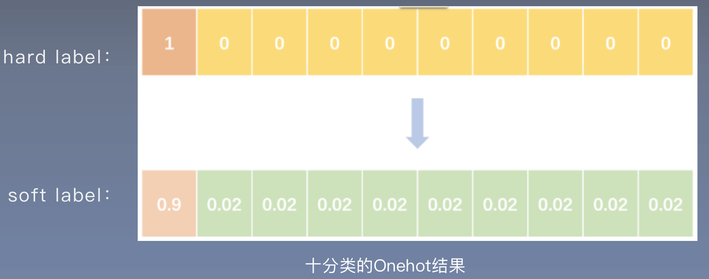
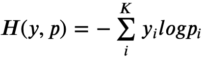
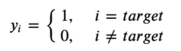
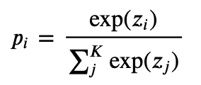
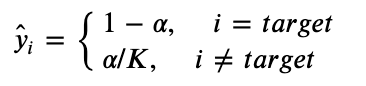

## 1. 标签平滑loss
标签平滑也是**一种正则化方法**，它**在label层面增加噪声**，使用soft label替代hard label。如下图：

**交叉熵loss**定义为：

其中：
- `K`为多分类的**类别数**，`y`为**onehot过后的label**：
- `p`为logits经过**softmax后的概率**：

**标签平滑使用soft label**，即：

- `α`为超参数，一般设置为`0.1`                      
