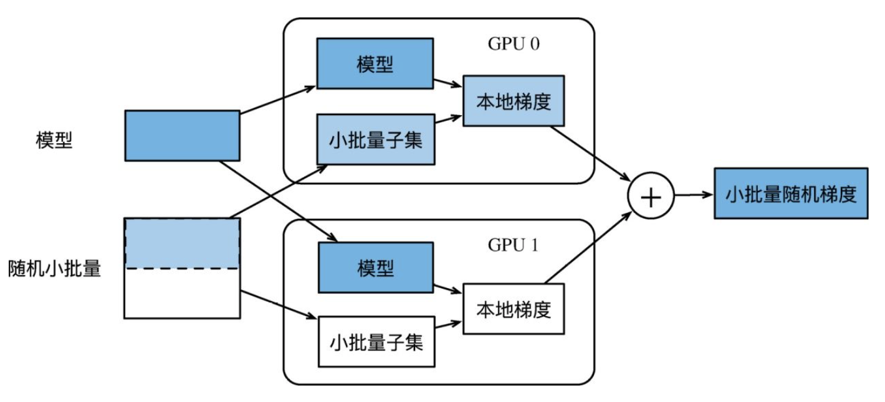
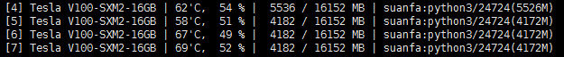
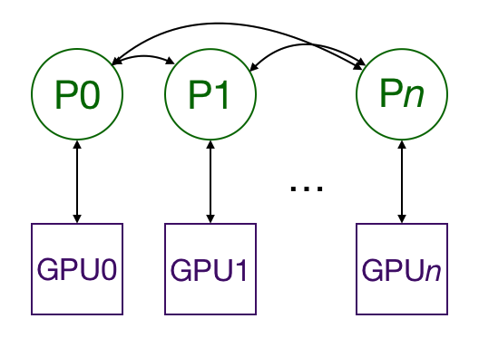

目录
1. [概览](#1-概览)
2. [DataParallel](#2-dataparallel)
   - [数据并行](#21-数据并行)
   - [负载不均衡问题](#22-负载不均衡问题)
3. [DistributedDataParallel](#3-distributeddataparallel)


## 1. 概览
模型的**并行训练**一般包含两种：

1. **单机多卡并行**（`nn.DataParallel`）；
   - 比较简单、使用范围较广
2. **多机多卡并行**（`nn.parallel.DistributedDataParallel`）
   - 较复杂，跨机器网络传输，易出问题（场景：大规模预训练）

## 2. DataParallel

### 2.1 数据并行
DataParallel翻译为**数据并行**，原理如图：



上面**过程**如下：
- 每块GPU和显存分别独立维护一套完整的模型参数；
- 给定一个batch，**将batch划分为2份，分别送入不同的gpu**；
- 每个gpu**根据自己的batch子集和模型参数**，计算本地梯度；
- 将所有gpu的**本地梯度相加**，得到当前的batch总梯度；
- 使用batch总梯度，分别更新不同gpu上的模型参数；

**注意**：
- 参数更新时，每块gpu上的模型参数都应该是一致的；

<br>

**部分代码**示例：
```python
# 将self.model用DataParallel封装
self.model = DataParallel(self.model, device_ids=list(range(torch.cuda.device_count())))

# 正常call
best_paths, loss = self.model(batch_input_ids, batch_att_mask, labels=batch_label_ids)

# 需将多张卡返回的sub-batch loss平均
loss = loss.mean()

# self.model当前为DataParallel对象，如果想取出真正的model对象，需要再module一下
self.model.module.bert_tokenizer
```
**完整代码**请参考：
- [easy_bert/bert4classification/classification_trainer.py](https://github.com/waking95/easy-bert/blob/main/easy_bert/bert4classification/classification_trainer.py)
- [bert4classification/classification_trainer.py](https://github.com/waking95/easy-bert/blob/main/easy_bert/bert4classification/classification_trainer.py)

注意：
1. DP(DataParallel)的使用非常简单，你可以直接使用其包装model对象，之后可以直接call它；
2. call之前，**确保所有参数**（如上例中的`batch_input_ids` `batch_att_mask` `batch_label_ids`）**的第`0`个维度都是batch的维度**，默认DP会沿着batch拆分为`N`份，`N`为GPU个数；
3. call之后，**返回的结果**（如上例中的`best_paths` `loss`）**都会沿着第0个维度拼起来**，对于`loss`，原本是一个数值，这里就被拼成了一个数组，因此要mean下；
4. 任何时候，用`self.model`时**都要清楚其实它是个`DataParallel`对象**，而不是`Model`对象，如果需要获取`Model`对象，需要`self.model.module`；

### 2.2 负载不均衡问题
DataParallel下的**主gpu（gpu0）承担了额外的汇总调度**等，一般会使用更多的显存，如图：



一些情况下，不均衡的程度较为严重。 为了缓解此问题，可以使用 [BalancedDataParallel](https://github.com/Link-Li/Balanced-DataParallel) ， 它允许**为主gpu设置较少的batch子集**。

## 3. DistributedDataParallel
`nn.parallel.DistributedDataParallel`，翻译为分布式数据并行，原理如下图：



- **每个GPU由一个独立的进程P控制**，**进程可能跨机器**；
- **不同进程间涉及数据、模型的同步**，较复杂，易出问题；
- 单机多gpu可以满足时, 不建议多机多gpu训练；
