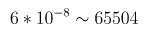
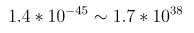
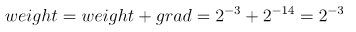

## 1. 混合精度原理
torch里面**默认的浮点数是单精度的**，即float32。我们**可以将部分模型参数用float16，即fp16半精度来表示**，一来可以降低显存的占用，二来可以提升训练和推理的速度。

那么，**能不能将所有参数由fp32换成fp16**？

答案是**不能**，因为：
1. **fp16能表示的数值范围有限**（），和fp32的范围（
   ）相比要窄很多，在**计算的时候容易出现数值溢出**，从而产生`Nan`问题。
   - 模型的梯度一般较小，如果用fp16，容易出现下溢。
2. 梯度过小时，可能会产生**舍入误差**，导致参数更新失败。如下图例子：
   - 

 

