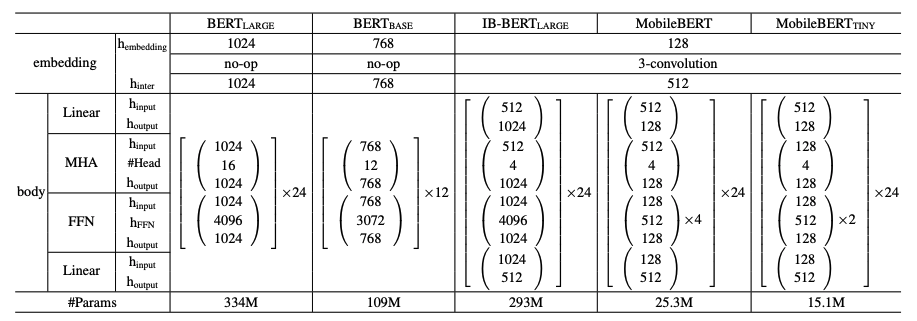
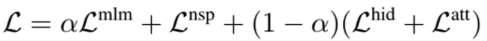
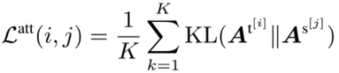
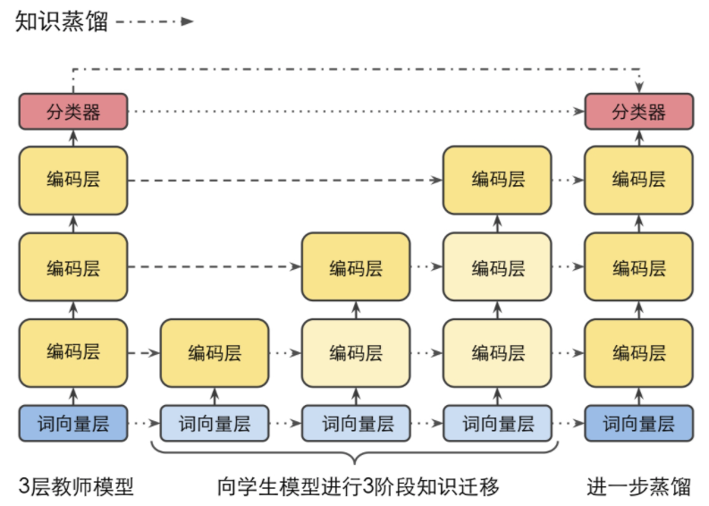

目录
1. [蒸馏简介](#1-蒸馏简介)
2. [蒸馏过的预训练模型——DistilBert](#2-蒸馏过的预训练模型distilbert)
3. [蒸馏过的预训练模型——TinyBert](#3-蒸馏过的预训练模型tinybert)
4. [蒸馏过的预训练模型——MobileBert](#4-蒸馏过的预训练模型mobilebert)

## 1. 蒸馏简介
基于transformer的模型比较重，硬件受限下，**如何提高推理速度**？

**知识蒸馏**（Knowledge Distillation）也是一种非常常用的方法

蒸馏一般包含**老师（Teacher）模型**和**学生（Student）模型**：
- **蒸馏目标**：用推理效率更高的、轻量的学生模型，近似达到老师的大模型的效果；
- 一般**老师的模型size（参数量）要大过学生**，比如用bert-large去教bert-base；
- 直接用学生模型去微调，满足不了我们的精度要求，因为学生模型容量较小；
- **蒸馏过程**：老师将知识（embedding/hidden/attention/logits等）教给学生；

接下来介绍3种**蒸馏过的预训练模型**：DistilBert、TinyBert、MobileBert

## 2. 蒸馏过的预训练模型——DistilBert
DistilBert是一个**6层的Bert**，由**12层的Bert-Base**当老师，在预训练阶段蒸馏得到

**预训练**时：
- DistilBert直接**使用老师的前6层初始化**；（因为参数的维度相同）
- **只进行了MLM任务**，没有进行NSP任务；
- 学生在学习时，除了**要利用真实的label**，还得**学习老师的隐层输出**（hidden）**和输出概率**（soft label）；


**蒸馏的loss**定义为：


1. 第一项：**有监督MLM损失**
   - 被Mask的部分作为label，与学生输出计算交叉熵：
2. 第二项：**蒸馏soft label损失**
   - 学生的输出`s_i`向老师的输出`t_i`看齐，两者计算交叉熵：
   - 蒸馏时，老师的输出`t_i`也称作**soft label**，它是logits经过softmax后的概率；
   - 这里的softmax函数一般带温度系数`T`，训练时设置`T=8`，推理时设置`T=1`：
3. 第三项：**输出层last hidden余弦损失**
   - 学生的last hidden `ℎ^t`向老师的last hidden `ℎ^s`看齐，计算余弦距离：

DistilBert取得的**成果**：
- **模型参数**由bert-base的110M降为66M；
- **推理速度**获得40%的提升；
- 下游直接微调时，获得97%的bert-base**效果**；

还可以**在微调阶段也进行蒸馏**，理论上可以取得更好的效果

<br>

可用的**中文预训练模型**：[bert-distil-chinese](https://huggingface.co/adamlin/bert-distil-chinese)

Distil-Bert模型的使用，和之前介绍过的各种bert变体模型的使用没有太大差别，这里**注意**：
1. 使用`transformers.DistilBertModel`加载模型；
2. distilbert**不支持输入**`token_type_ids`、`position_ids`**参数**；
3. **上面预训练模型直接加载会报错**，你需要将`config.json`文件完全换成如下内容：

```json
{
  "activation": "gelu",
  "architectures": [
    "DistilBertForMaskedLM"
  ],
  "attention_dropout": 0.1,
  "dim": 768,
  "dropout": 0.1,
  "hidden_dim": 3072,
  "initializer_range": 0.02,
  "max_position_embeddings": 512,
  "model_type": "distilbert",
  "n_heads": 12,
  "n_layers": 6,
  "pad_token_id": 0,
  "qa_dropout": 0.1,
  "seq_classif_dropout": 0.2,
  "sinusoidal_pos_embds": true,
  "tie_weights_": true,
  "vocab_size": 21128
}
```

**完整代码**请参考以下源代码：

- [easy_bert/bert4classification/classification_model.py](https://github.com/waking95/easy-bert/blob/main/easy_bert/bert4classification/classification_model.py)
- [easy_bert/bert4sequence_labeling/sequence_labeling_model.py](https://github.com/waking95/easy-bert/blob/main/easy_bert/bert4sequence_labeling/sequence_labeling_model.py)

<br>

DistilBert**蒸馏仅学习老师的最后部分，是否可以向老师学习更多部分呢**？

## 3. 蒸馏过的预训练模型——TinyBert
TinyBert：
- 学得更彻底，除了蒸馏老师的soft label、last hidden，**还蒸馏了embedding层和中间层**；
- 使用**两阶段蒸馏**，即**预训练阶段**和**微调阶段**都进行了蒸馏；

**4层**的TinyBert，能够达到老师（Bert-base）**效果**的96.8%、**参数量**缩减为原来的13.3%、仅需要原来10.6%的**推理时间**

<br>

TinyBert的**蒸馏loss**为：


1. 第一项：**词向量层损失**
   - 计算**学生词向量**`v^s`和**老师词向量**`v^t`的均方误差：
   - 因为`v^s`和`v^t`的维度未必一致，这里需要参数`W^e`做映射
2. 第二项：**中间层损失**
   - 若学生`4`层，老师`12`层，则老师的`(3,6,9,12)`层分别蒸馏到学生的`(1,2,3,4)`层
   - 中间层的损失由**隐层均方误差损失**和**注意力损失**组成：
   - **隐层均方误差损失**：
     - 学生的第`i`层隐层输出 和 老师的第`j`层隐层输出 计算MSE，用`W^ℎ`做映射
   - **注意力损失**：
     - 学生第`i`层多头注意力矩阵和老师第`j`层多头注意力矩阵计算MSE，`K`为注意力的head数
3. 第三项：**预测层损失**
   - 和DistilBert一样，学生学习老师的soft label
   - 并计算交叉熵：

TinyBert的**中间层蒸馏**：


<br>

TinyBert的**两阶段蒸馏**：


在大规模语料上**首先进行通用MLM任务的蒸馏**，在**下游任务**时，先学好老师模型，**再进行蒸馏**。

**注意**：
1. **预训练蒸馏时TinyBert没有使用预测层损失**，主要因为预训练阶段主要学习文本表示；
2. DistilBert可以不微调蒸馏，但T**inyBert最好要做微调蒸馏**，仅4层的它直接微调效果可能下降明显；
3. 微调时，**TinyBert作者做了一些数据增强**，主要是同义词替换；

<br>

**部分代码**示例：

```python
# 蒸馏配置
distill_config = DistillationConfig(
    # 设置温度系数temperature, tiny-bert论文作者使用1表现最好，一般大于1比较好
    temperature=self.temperature,
    # 设置ground truth loss权重
    hard_label_weight=self.hard_label_weight,
    # 设置预测层蒸馏loss（即soft label损失）为交叉熵，并稍微放大其权重
    kd_loss_type=self.kd_loss_type, kd_loss_weight=self.kd_loss_weight,
    # 配置中间层蒸馏映射
    intermediate_matches=[
        # 配置hidden蒸馏映射、维度映射
        {'layer_T': 0, 'layer_S': 0, 'feature': 'hidden', 'loss': 'hidden_mse', 'weight': 1,
         'proj': ['linear', 312, 768]},  # embedding层输出
        {'layer_T': 3, 'layer_S': 1, 'feature': 'hidden', 'loss': 'hidden_mse', 'weight': 1,
         'proj': ['linear', 312, 768]},
        {'layer_T': 6, 'layer_S': 2, 'feature': 'hidden', 'loss': 'hidden_mse', 'weight': 1,
         'proj': ['linear', 312, 768]},
        {'layer_T': 9, 'layer_S': 3, 'feature': 'hidden', 'loss': 'hidden_mse', 'weight': 1,
         'proj': ['linear', 312, 768]},
        {'layer_T': 12, 'layer_S': 4, 'feature': 'hidden', 'loss': 'hidden_mse', 'weight': 1,
         'proj': ['linear', 312, 768]},
        # 配置attention矩阵蒸馏映射，注意layer序号从0开始
        {"layer_T": 2, "layer_S": 0, "feature": "attention", "loss": "attention_mse", "weight": 1},
        {"layer_T": 5, "layer_S": 1, "feature": "attention", "loss": "attention_mse", "weight": 1},
        {"layer_T": 8, "layer_S": 2, "feature": "attention", "loss": "attention_mse", "weight": 1},
        {"layer_T": 11, "layer_S": 3, "feature": "attention", "loss": "attention_mse", "weight": 1},
    ]
)

# 训练配置
optimizer = AdamW(self.student_model.parameters(), lr=self.lr)  # 使用大一点的lr
train_config = TrainingConfig(
    output_dir=self.student_model_dir, device=self.student_trainer.device,
    data_parallel=self.enable_parallel, ckpt_frequency=self.ckpt_frequency  # 一个epoch存ckpt_frequency次模型
)

# 配置model中logits hiddens attentions losses的获取方法
def simple_adaptor(batch, model_outputs):
    return {
        'logits': model_outputs[-1]['logits'], 'hidden': model_outputs[-1]['hiddens'],
        'attention': model_outputs[-1]['attentions'], 'losses': model_outputs[1],
    }

# 蒸馏
distiller = GeneralDistiller(
    train_config=train_config, distill_config=distill_config,
    model_T=self.teacher_model, model_S=self.student_model,
    adaptor_T=simple_adaptor, adaptor_S=simple_adaptor
)
with distiller:
    logger.info('start to knowledge distill ...')
    distiller.train(optimizer, train_dataloader, num_epochs=epoch)
    logger.info('distill finish')
```

**完整代码**请参考以下源代码：
- [easy_bert/tinybert_distiller.py](https://github.com/waking95/easy-bert/blob/main/easy_bert/tinybert_distiller.py)

## 4. 蒸馏过的预训练模型——MobileBert
DistilBert和TinyBert主要将模型变浅，能否**只降低模型宽度来实现压缩**？

MobileBert的思路就是将模型变窄，
- 研究表明，**相比于模型变窄，模型变浅让精度损失更大**；
- 24层的**MobileBert，就是一个变窄了的Bert-Large**；

**直接finetune**的MobileBert，可以达到Bert-Base 99.2%的**效果**、**参数量**小了4倍、**推理速度**快了5.5倍

<br>


- **(a)图是标准的bert**，L层transformer；
- **(b)图是Teacher模型**，是一个Inverted-Bottleneck **Bert-Large**；
  - Bottleneck结构是一个线性层，主要将模型加宽；
- **(c)图是MobileBert学生模型**，它的Bottleneck结构主要将模型变窄；

<br>

下面是相关的**模型对比**：



从上图可知：
- **IB-Bert**将`521`的hidden加宽到`1024`，来**近似标准的Bert-Large**；
- MobileBert将`512`的hidden变窄到`128`，减少了参数量；

MobileBert还做了**一些改进**：
1. **堆了更多的Feed Forward层**，防止FFN的HHA的参数数量比例失衡；
2. **移除了LayerNorm**，替换Gelu为Relu激活；
3. embedding层为`128`，通过kernel size为`3`的1维卷积转化为`512`维；

<br>

**MobileBert的损失**：



- 包含四项：**有监督MLM损失**、**有监督NSP损失**、**隐层蒸馏损失**、**注意力矩阵损失**
- `0≤α≤1`，权衡 第一项损失 和 最后两项损失，这里取`0.5`
- **各项损失的计算方法基本与前面一致**，除了注意力矩阵损失：
  - 使用KL散度替代MSE

<br>

MobileBert使用**渐进式知识迁移**蒸馏：



- 最开始的**Embedding层**和最后的**分类层**直接**从老师拷贝到学生**；
- 由于老师学生层数相同，**学生逐层学习老师的hidden和attention**；
- 当学生**在学习`i`层时，前面的所有层（<i层）参数均不更新**；
