## 1. 蒸馏简介
基于transformer的模型比较重，硬件受限下，**如何提高推理速度**？

**知识蒸馏**（Knowledge Distillation）也是一种非常常用的方法

蒸馏一般包含**老师（Teacher）模型**和**学生（Student）模型**：
- **蒸馏目标**：用推理效率更高的、轻量的学生模型，近似达到老师的大模型的效果；
- 一般**老师的模型size（参数量）要大过学生**，比如用bert-large去教bert-base；
- 直接用学生模型去微调，满足不了我们的精度要求，因为学生模型容量较小；
- **蒸馏过程**：老师将知识（embedding/hidden/attention/logits等）教给学生；

接下来介绍3种**蒸馏过的预训练模型**：DistilBert、TinyBert、MobileBert

## 2. 蒸馏过的预训练模型——DistilBert
DistilBert是一个**6层的Bert**，由**12层的Bert-Base**当老师，在预训练阶段蒸馏得到

**预训练**时：
- DistilBert直接**使用老师的前6层初始化**；（因为参数的维度相同）
- **只进行了MLM任务**，没有进行NSP任务；
- 学生在学习时，除了**要利用真实的label**，还得**学习老师的隐层输出**（hidden）**和输出概率**（soft label）；

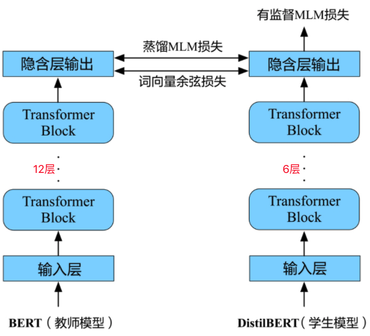

**蒸馏的loss**定义为：

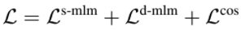

1. 第一项：**有监督MLM损失**
   - 被Mask的部分作为label，与学生输出计算交叉熵：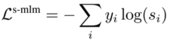
2. 第二项：**蒸馏soft label损失**
   - 学生的输出`s_i`向老师的输出`t_i`看齐，两者计算交叉熵：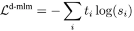
   - 蒸馏时，老师的输出`t_i`也称作**soft label**，它是logits经过softmax后的概率；
   - 这里的softmax函数一般带温度系数`T`，训练时设置`T=8`，推理时设置`T=1`：
3. 第三项：**输出层last hidden余弦损失**
   - 学生的last hidden `ℎ^t`向老师的last hidden `ℎ^s`看齐，计算余弦距离：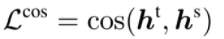

DistilBert取得的**成果**：
- **模型参数**由bert-base的110M降为66M；
- **推理速度**获得40%的提升；
- 下游直接微调时，获得97%的bert-base**效果**；

还可以**在微调阶段也进行蒸馏**，理论上可以取得更好的效果

DistilBert**蒸馏仅学习老师的最后部分，是否可以向老师学习更多部分呢**？

## 3. 蒸馏过的预训练模型——TinyBert
TinyBert：
- 学得更彻底，除了蒸馏老师的soft label、last hidden，**还蒸馏了embedding层和中间层**；
- 使用**两阶段蒸馏**，即**预训练阶段**和**微调阶段**都进行了蒸馏；

**4层**的TinyBert，能够达到老师（Bert-base）**效果**的96.8%、**参数量**缩减为原来的13.3%、仅需要原来10.6%的**推理时间**

 

TinyBert的**蒸馏loss**为：

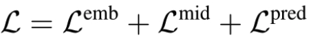

1. 第一项：**词向量层损失**
   - 计算**学生词向量**`v^s`和**老师词向量**`v^t`的均方误差：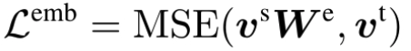
   - 因为`v^s`和`v^t`的维度未必一致，这里需要参数`W^e`做映射
2. 第二项：**中间层损失**
   - 若学生`4`层，老师`12`层，则老师的`(3,6,9,12)`层分别蒸馏到学生的`(1,2,3,4)`层
   - 中间层的损失由**隐层均方误差损失**和**注意力损失**组成：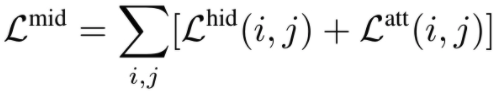
   - **隐层均方误差损失**：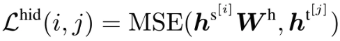
     - 学生的第`i`层隐层输出 和 老师的第`j`层隐层输出 计算MSE，用`W^ℎ`做映射
   - **注意力损失**：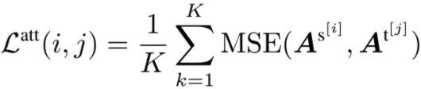
     - 学生第`i`层多头注意力矩阵和老师第`j`层多头注意力矩阵计算MSE，`K`为注意力的head数
3. 第三项：**预测层损失**
   - 和DistilBert一样，学生学习老师的soft label
   - 并计算交叉熵：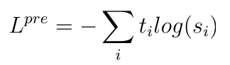

TinyBert的**中间层蒸馏**：

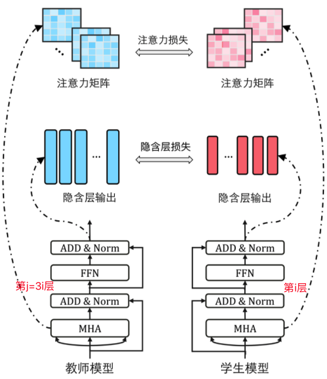

 

TinyBert的**两阶段蒸馏**：

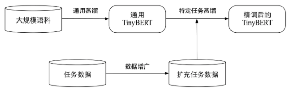

在大规模语料上**首先进行通用MLM任务的蒸馏**，在**下游任务**时，先学好老师模型，**再进行蒸馏**。

**注意**：
1. **预训练蒸馏时TinyBert没有使用预测层损失**，主要因为预训练阶段主要学习文本表示；
2. DistilBert可以不微调蒸馏，但T**inyBert最好要做微调蒸馏**，仅4层的它直接微调效果可能下降明显；
3. 微调时，**TinyBert作者做了一些数据增强**，主要是同义词替换；
