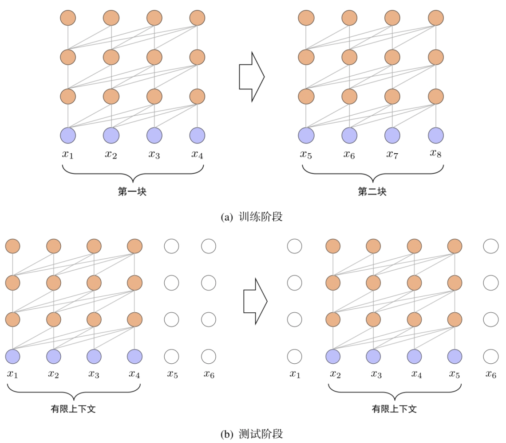
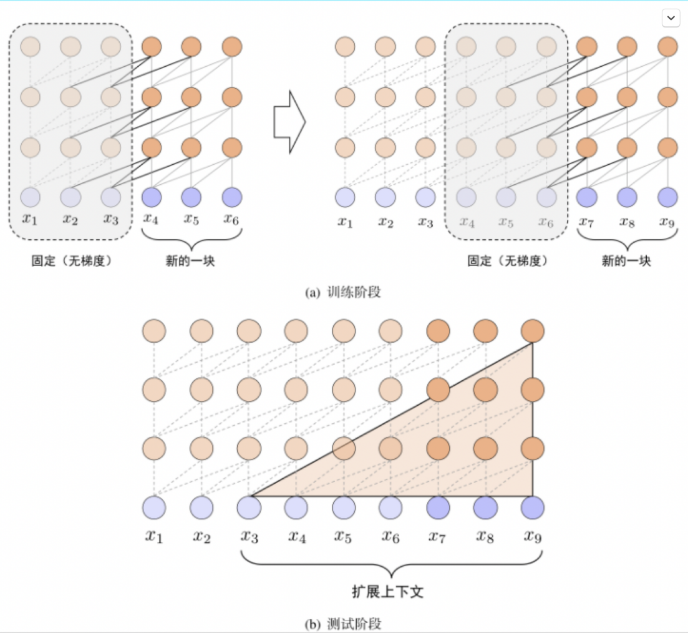
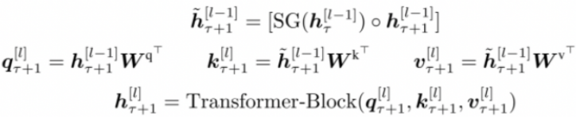
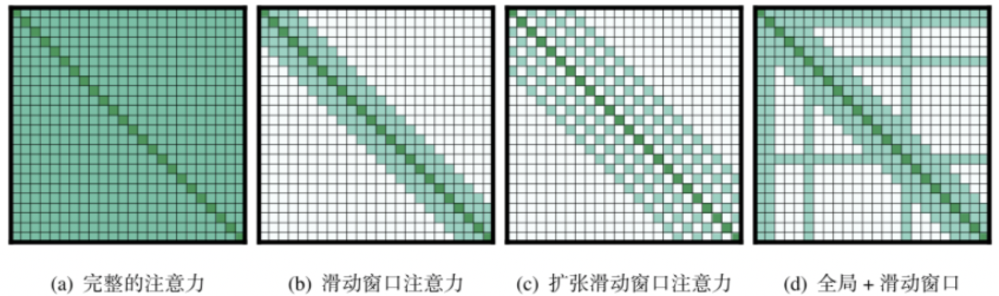
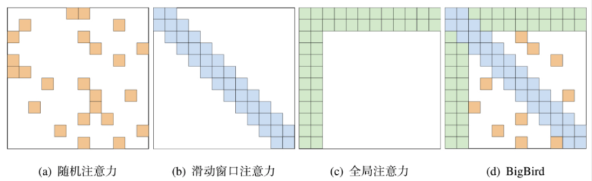

目录
1. [概览](#1-概览)
2. [数据层面](#2-数据层面)
   - [截断法](#21-截断法)
   - [分段法](#22-分段法)
   - [压缩法](#23-压缩法)
3. [模型层面](#3-模型层面)
   - [Transformer-XL](#31-transformer-xl)
   - [Longformer](#32-longformer)
   - [BigBird](#33-bigbird)

## 1. 概览
**Bert的输入最多为512字**，如果待处理的文本超过512字呢？

**主要做法**：
1. **数据层面**
   - **截断法**：粗暴前或后截断
   - **分段法**：分为多个512字的段
   - **压缩法**：裁剪无意义的句子
2. **模型层面**
   - Transformer-XL、Reformer、Longformer、BigBird等

## 2. 数据层面
### 2.1 截断法
截断法最容易想到，主要包含：
1. **头截断**，只保留最前面N（如512）个字；
2. **尾截断**，只保留最后面N个字；
3. **头+尾截断**，开头结尾各保留一部分；

注意：
1. 虽然是512，去除`[CLS]`和`[SEP]`，实际是510字；
2. 选择**头截断**、还是**尾截断**、还是**两者结合**，主要看数据的**关键信息分布**。比如：文本里关键信息主要在头部，那采用头截断可能会比较好；
3. **截断法**适合大量几百字的文本，如果文本几千字，粗暴截断会丢失重要信息；

### 2.2 分段法
**做法**：
1. 将长文本依次**划分为n个不超过512字的段**（最好考虑断句）；
2. 针对n个段**分别过bert**编码；
3. 将n段经过bert后的`[CLS]`向量进行**max-pooling或mean-pooling**；
   - Max-Pooling会保留突出的特征，Mean-Pooling会将特征打平。这和TextCNN后接Max-Pooing是一个道理。
4. 然后再接一个**全连接层做分类**；

**特点**：
1. **考虑到全局信息**，相比截断法，对几千字的长文本效果较好；
2. **性能较差**，每个段都要encode一次，文本越长，速度越慢；
3. **段落之间联系会丢失**，易出现badcase；

### 2.3 压缩法
**压缩法**的核心是**裁减掉一些无意义的句子**，
1. 一些文章开头或结尾有一些无用“套路话术”，这些可以删除掉；
2. 去除url，因为它占了很多个字符；
3. 句子筛选，只保留最重要的N个句子，如：计算句子和标题的相似度；
4. ……

## 3. 模型层面
### 3.1 Transformer-XL
**分段法**做文本生成的**问题**：
1. 训练阶段，分块，**块之间没有信息交互**；
2. 预测阶段（文本生成），**以固定size滑动窗口，效率很低**；

如下图所示：

 

为了解决前面问题，transformer-xl提出了一个 **状态复用的块级别循环**，原理如下图：

**训练阶段**：
1. 依然是分块输入，但**在计算当前块的输出时，会拼接上前一块的隐层状态**；
2. 第`τ+1`块`l`层的输出公式：
   - 
   - `º`表示拼接；`SG`表示不参与BP运算

**预测阶段**：
1. 按块产生输出；
2. 因为块级别循环，实际使用的输入不仅是当前块输入，而是更长的扩展上下文；

 

有个问题，**所有块的位置信息都一样**（比如都是0~512），合理么？

Transformer-XL引入了**相对位置编码**（区别于transfomer的绝对位置编码），被添加到self-attention上。

这里不再扩展，需要了解更多参考：
[Transformer-XL: Attentive Language Models Beyond a Fixed-Length Context](https://arxiv.org/pdf/1901.02860.pdf)

### 3.2 Longformer
Longformer致力于**减少自注意力计算量**，即**稀疏注意力**，将文本处理长度扩充到`4096`。

主要提出了三种注意力：**滑动窗口注意力**、**扩张滑动窗口注意力**、**全局+滑动窗口**，如下图：

1. **滑动窗口注意力**：
   - 如图b，引入**固定长度的滑动窗口**，即当前词只与相邻的k个词关联；
   - **注意力复杂度**从`O(n^2)`降到`O(nk)`；
   - 类似于卷积，尽管单层感受野是`k`，但是堆`L`层，感受野能达到`L*k`；
2. **扩张滑动窗口注意力**：
   - 如图c，在滑动窗口注意力基础上**引入膨胀**，类似IDCNN，跳过一些位置，扩充单层感受野；
3. **全局注意力**：
   - 如图d，我们需要**全局注意力**来关注一些预先设置的位置；
   - 对分类问题，`[CLS]`须设置为全局注意力，确保其能Attention到整个序列；

### 3.3 BigBird
BigBird也基于稀疏注意力，额外增加了**随机注意力**，如下图a：

